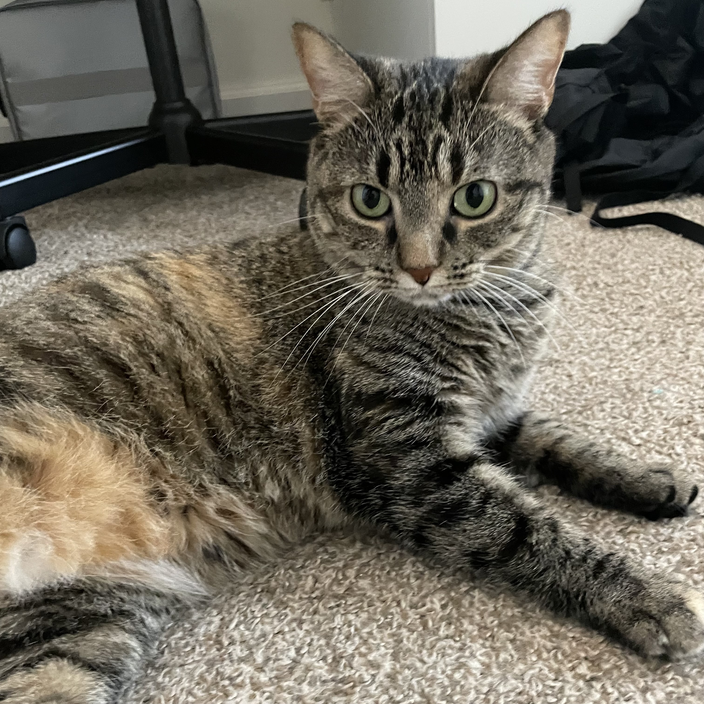
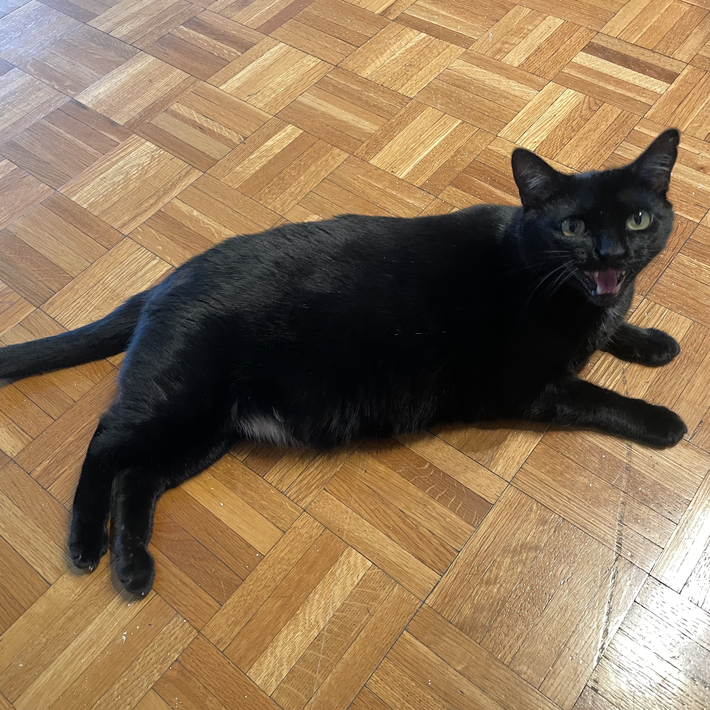
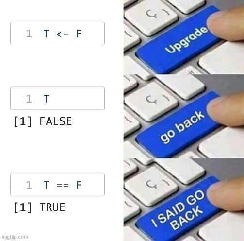
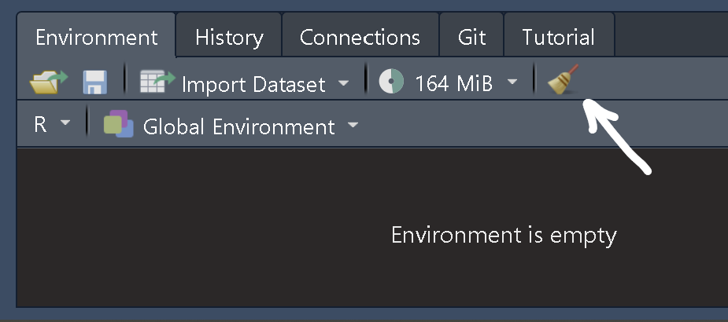
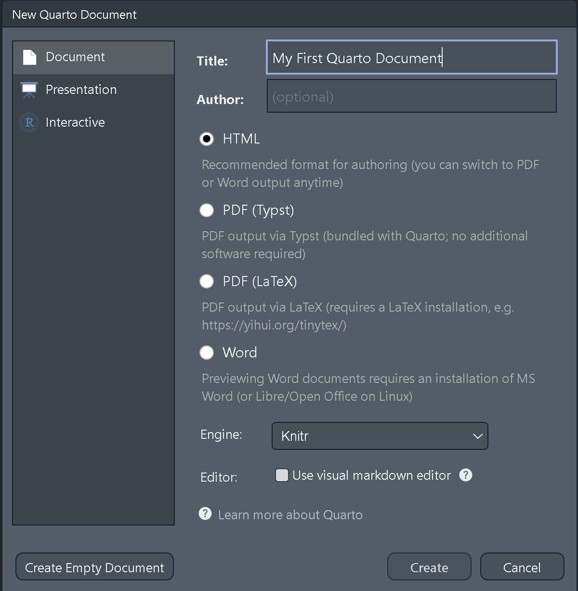
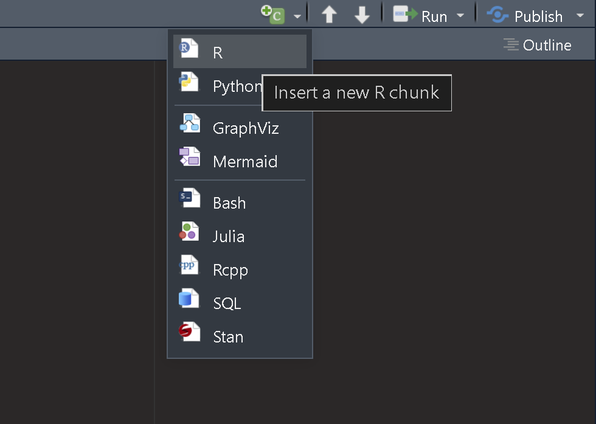
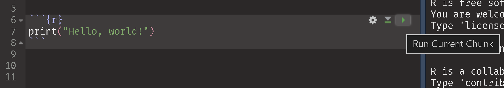
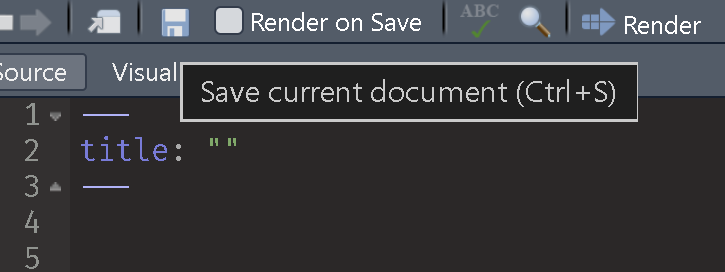
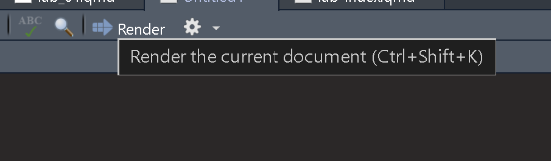

## Lab Goals

In this lab you will learn how to...

- apply the statistical concepts taught in lecture programmatically

- create effective and efficient data visualizations 

- wrangle / manage real, messy data into workable, tidy data

- code with best practices that will make things smoother for present, but **especially future**, you

## Outline

- Introductions!
- Lab Syllabus
- What is R?
- RStudio Layout
- R Basics
- Quarto Basics


## Instructor Introduction

Hi! I'm Jess Helmer. I'm a third-year PhD student in Quantitative Psychology.

My research focuses on the measurement and modeling of psychological data.

:::: {.columns}

::: {.column}
::: subpoint
○ Email: [jhelmer3\@gatech.edu](mailto:jhelmer3\@gatech.edu) 
:::
::: subpoint
○ Office: J.S. Coon Rm 241 
:::
::: subpoint
○ Office Hours: Fridays, 1–2pm, my office / [Zoom](https://gatech.zoom.us/j/99304234613?pwd=RaHoZaucbajqE1VZzClFi7XF8bpn6l.1)
:::
::: subsubpoint
○ Or by appointment
:::
:::

::: {.column .fragment}
{width=250}
{width=250}
:::
::::


## What You Can Expect From Me

I am available as a resource! Please feel free to reach out / email anytime if you need help, have questions about the lab, or have any suggestions or feedback for the class.

I encourage helping each other / collaboration during the lab. While working on assignments, I will try to answer everyone's questions as soon as I can, but if someone near you is confused and you can help, feel free to discuss.

I plan on recording the lecture component of labs on Zoom. If you need to join remotely (e.g., not feeling well, traveling, etc.) please email me at least 15 minutes before lab starts so I can send you the Zoom link.

I will do a lot of live coding during lab. I encourage you to follow along with me!


## Student Introductions

- Name
- Program
- Coding Experience? R?
- Anything else!


## Lab Activities

Students are expected to attend and participate in all scheduled labs.

We will have a lab lecture and activity each week (barring institute holidays) except for times when lab gets swapped with lecture (see [course schedule](https://jhelmer3.github.io/PSYC6019-2026/syllabus.html#class-schedule)).

Students are expected to work on the activity during the scheduled lab time.

Lab activities are due on Canvas at 11:59pm the same day they are distributed.

We will not be able to accept late lab activities!

Activity distributed after lecture (with plenty of time to complete!)


## Lab Activities

Please submit both the rendered (.html or .pdf) and the **source Quarto (.qmd)** file.

::: subpoint
○ Without your R code, we will not be able to give any credit.
:::

As long as a complete attempt is made, full credit will be given.


## Lab Project

One of the best ways to learn R is to work on an independent data analysis project with real data.

Opportunity to immerse yourself in the language, explore the messiness of real data, make and learn from mistakes. 

We can help you find a dataset if needed, but you are strongly encouraged to find data you are particularly interested in.

More details to come---will be due at the end of the semester.


## Extra Credit: R Conference

:::: {.columns}
::: {.column width="25%"}
<br>
[Assignment and Registration Details](https://jhelmer3.github.io/PSYC6019-2026/extra-credit.html){preview-link="true"}
:::

::: {.column width="75%"}
[](https://conf.posit.co/2026/){target="blank" preview-link="true"}
:::
::::


## About AI

AI can be a very helpful tool for learning coding! Feel free to use it to clarify concepts, troubleshoot code, or syntax explanations.

However, for the assignments, your code needs to be your own.

It is important to practice and gain experiencing coding independently!


## Lab Resources

:::: {.columns}

::: {.column width="33%"}
[R for Data Science (2e)](https://r4ds.hadley.nz/){target="blank" preview-link="true"}

[](https://r4ds.hadley.nz/){target="blank" preview-link="true"}
:::

::: {.column width="33%"}
[ggplot2: Elegant Graphics for Data Analysis (3e)](https://ggplot2-book.org/){target="blank" preview-link="true"}

[](https://ggplot2-book.org//){target="blank" preview-link="true"}
:::

::: {.column width="33%"}
[Quarto Documentation](https://quarto.org/docs/reference/){target="blank" preview-link="true"}

[](https://quarto.org/docs/reference/){target="blank" preview-link="true"}
:::

::::

All free, open source materials for learning R


## Lab Resources (Other)

:::: {.columns}
::: {.column width="33%"}
[Introduction to Data Exploration and Analysis with R (IDEAR)](https://bookdown.org/mikemahoney218/IDEAR/){target="blank" preview-link="true"}

Similar content as R4DS but with a different writing style.
:::

::: {.column width="33%"}
[What They Forgot to Teach You About R](https://rstats.wtf/){target="blank" preview-link="true"}

:::

::: {.column width="33%"}
[Happy Git with R](https://happygitwithr.com/){target="blank" preview-link="true"}

An excellent resource for getting started with Git and GitHub as an R user.
:::
::::


# Questions?


## What is R?

Open source coding language, primarily used for data analysis and data science.

{.absolute width="200" bottom=20 right=0}

Coding (per the IDEAR book):

::: fragment
"Giving very specific instructions to a very stupid machine."
:::

</br>

::: fragment
```{r}
print("Hello, World!")
```
:::


## Why R?

R has many "packages" for statistical functions and a large, enthusiastic community of statistical programmers.

::: subpoint
○ We will get to know many of these packages!
:::

R is open source: you can see the exact code that underlies the functions you use

::: subpoint
○ And if you'd like, you can modify it
:::

Because R is a programming language, you can make your own code / functions as commands, instead of just relying on existing features.


## What is RStudio?

An interface for using and coding in R

Helps keep R files and projects organized

Helps "knit" together code, output, and text to create reports


## Installing R

We need to download two things:

[R](https://cloud.r-project.org/) and [RStudio](https://posit.co/download/rstudio-desktop/#download)

R is the language, RStudio is an Interactive Development Environment (IDE).

We will use R through RStudio.


## RStudio Introduction

Files, Plots, Packages

Environment, History

Console


## R Console

```{r}
2 + 4
```

::: fragment
```{r}
2 + 4 / 4
```
:::

::: fragment
PEMDAS!
:::

::: fragment
```{r}
2 ^ 3
```
:::


## Vectors

```{r}
c(2, 4, 6)
```

::: fragment
```{r}
c(1, "hello!", "Georgia Tech")
```
:::

::: fragment
`c()` function

- Stands for "combine"
:::

::: fragment
`?` operator to see the documentation for a function

```{r}
#| eval: false
?c
```
:::


## Data Types

```{r}
c(2, 4, 6)
```

```{r}
c(2, "hello!", "Georgia Tech")
```

:::: {.columns}
::: {.column width="50%"}

::: fragment
Quotes around `1` in the second vector, not in the first
:::

::: fragment
Vectors can only hold one type of data!

- Numeric

- Character
:::

`class()` function tells us the data type
:::

::: {.column width="50%"}
::: fragment
```{r}
c(1, 2, 3) / 3
```
:::

::: fragment
```{r}
#| error: true
class(c(1, "hello!", "Georgia Tech") )
c(1, "hello!", "Georgia Tech") / 3
```
:::

::: fragment
Error because we cannot divide characters
:::
:::
::::


## Data Types

Logical type, `TRUE` or `FALSE`. `TRUE` and `FALSE` can be abbreviated as `T` and `F`.

```{r}
TRUE
```

::: fragment
```{r}
c(1, "hello!", TRUE)
```
:::

::: fragment
```{r}
c(TRUE, FALSE)
```
:::


<!-- ## Data Types: Logical (boolean) -->

<!-- ```{r} -->
<!-- 6 > 4 -->
<!-- ``` -->

<!-- ::: fragment -->
<!-- ```{r} -->
<!-- 12 / 2 < 6 -->
<!-- ``` -->
<!-- ::: -->

<!-- ::::: {.columns} -->
<!-- ::: {.column .fragment} -->
<!-- The `<`, `>`, and `<=` symbols are *logical operators* -->

<!-- Logical data handled like binary numeric data -->

<!-- ```{r} -->
<!-- TRUE == 1 -->
<!-- ``` -->

<!-- ```{r} -->
<!-- FALSE + 3 -->
<!-- ``` -->
<!-- ::: -->

<!-- :::: {.column .fragment} -->
<!-- `TRUE` and `FALSE` can be abbreviated as `T` and `F` -->

<!-- ```{r} -->
<!-- TRUE == T -->
<!-- ``` -->

<!-- ```{r} -->
<!-- FALSE == F -->
<!-- ``` -->

<!-- ::: fragment -->
<!-- Harder to tell apart, so be careful! -->
<!-- ::: -->
<!-- :::: -->
<!-- ::::: -->


<!-- ## Practice Break! -->

<!-- ```{r} -->
<!-- #| output-location: fragment -->
<!-- 2 + 2 -->
<!-- ``` -->

<!-- ::: fragment -->
<!-- ```{r} -->
<!-- #| output-location: fragment -->
<!-- 2 + 2 / 2 -->
<!-- ``` -->
<!-- ::: -->

<!-- ::: fragment -->
<!-- ```{r} -->
<!-- #| output-location: fragment -->
<!-- 2 + 2 / 2 ^ 2 -->
<!-- ``` -->
<!-- ::: -->

<!-- ::: fragment -->
<!-- ```{r} -->
<!-- #| output-location: fragment -->
<!-- #| error: true -->
<!-- c("hello!", 2) / 2 -->
<!-- ``` -->
<!-- ::: -->


## Variable Assignment

In R, we can assign objects (including functions) to some variable with the *assignment operator* `<-`.

You can also print objects by just running their name.

```{r}
# assign variable a the value 1
a <- 1

# print a
a
```


## Variable Assignment

```{r}
a <- c(1, 2, 3)
a
```

```{r}
a <- c("Hello, world!")
a
```

Every time we reassign a value to `a`, it holds that new value

Overwrites previous value!


## Variable Assignment

Overwriting can mess stuff up!

:::: {.columns}
::: {.column width="50%"}

:::

::: {.column width="50%"}
::: fragment
Generally, we want to avoid overwriting these "[reserved words](https://stat.ethz.ch/R-manual/R-devel/library/base/html/Reserved.html){target="blank" preview-link="true"}" or names of key functions.
:::

::: fragment
But, how can we fix things if we do?
:::
:::
::::


## Blank Slate

Clearing your environment and restarting R frequently helps you reset

:::: {.columns}
::: {.column width="50%"}
### How to Clear Your Environment


:::

::: {.column width="50%"}
### How to Restart R

1)  Manually:

::: subpoint
○ Session \> Restart R.
:::

2)  Shortcut:

::: subpoint
○ Use the shortcut Ctrl + Shift + F10 (Windows) or Cmd + Shift + F10.
:::
:::
::::


## Clearing Environment and Restarting R

:::: {.columns}
::: {.column width="40%"}
I strongly (!!) suggest you change these default RStudio settings in order to always start R with a blank slate.

Tools > Global Options

:::

::: {.column width="60%"}
{width=80%}
:::
::::


::: footer
[What They Forgot to Teach You About R](https://rstats.wtf/source-and-blank-slates#always-start-r-with-a-blank-slate)
:::


<!-- ## Variables in Statistics: Numeric vs. Categorical -->

<!-- ### Numeric -->

<!-- ::: subpoint -->
<!-- ○ Quantitative -->
<!-- ::: -->

<!-- ::: subpoint -->
<!-- ○ Values describing a measurable quantity as a number -->
<!-- ::: -->

<!-- ::: subpoint -->
<!-- ○ “How many” or “how much” -->
<!-- ::: -->

<!-- ### Categorical -->

<!-- ::: subpoint -->
<!-- ○ Distinguish distinct elements or entities -->
<!-- ::: -->

<!-- ::: subpoint -->
<!-- ○ Name, gender, ethnicity... -->
<!-- ::: -->

<!-- ## Four Types of Measurement -->

<!-- :::: {.columns} -->
<!-- ::: {.column width="50%"} -->
<!-- ### Nominal -->

<!-- ::: subpoint -->
<!-- ○ Variable that represents categories without any inherent order. -->
<!-- ::: -->

<!-- ::: subpoint -->
<!-- ○ E.g., types of fruit (“apple,"“orange,” “banana”). -->
<!-- ::: -->

<!-- ### Ordinal -->

<!-- ::: subpoint -->
<!-- ○ Variable that represents categories with a meaningful order. -->
<!-- ::: -->

<!-- ::: subpoint -->
<!-- ○ For example, levels of satisfaction (“very unsatisfied,” “unsatisfied,” “neutral,” “satisfied,” “very satisfied”) -->
<!-- ::: -->
<!-- ::: -->

<!-- ::: {.column width="50%"} -->
<!-- ### Discrete -->

<!-- ::: subpoint -->
<!-- ○ Variable that can only take specific values. -->
<!-- ::: -->

<!-- ::: subpoint -->
<!-- ○ Think of things you can count, like the number of people in a room or the number of apples in a basket. -->
<!-- ::: -->

<!-- ### Continuous -->

<!-- ::: subpoint -->
<!-- ○ Variable that can take any value within a range. -->
<!-- ::: -->

<!-- ::: subpoint -->
<!-- ○ Think of things you can measure, like height or time. -->
<!-- ::: -->
<!-- ::: -->
<!-- :::: -->


<!-- ## Statistical Variables in R -->

<!-- | Nominal | Ordinal | Discrete | Continuous | -->
<!-- |---------|---------|----------|------------| -->
<!-- | `factor` | `factor` | `integer` | `float` | -->
<!-- | `character` | | | | -->


## Dataframes

Table of data organized by columns

Can make by hand with the `data.frame()` function:

```{r}
data.frame(
  x = c(1, 2, 3),
  y = c("a", "b", "c"),
  z = c(TRUE, FALSE, TRUE)
)
```

Shift+Enter to go to new line on Console

Most of the time, we import data (and don't manually type it in)

In console, can press up arrow to reload last line of code


## Dataframes

If you already have vector objects saved, you don't have to type them in again

```{r}
a <- c(1, 2, 3)
b <- c(2, 3, 4)
c <- c(3, 4, 5)
```

<br>

:::: columns
::: {.column width="30%"}
```{r}
data.frame(a = a,
           b = b,
           c = c)
```
:::

::: {.column width="30%"}
```{r}
data.frame(a, b, c)

```
:::

::: {.column width="30%"}
```{r}
data.frame(A = a, b, c)
```
:::
::::


## R Scripts

R script files end with .R

### How to Create an R Script File

1)  Manually

::: subpoint
File \> New File \> R Script
:::

2)  Shortcut

::: subpoint
Ctrl + Shift + N
:::


## R Projects

RStudio's way of helping organizing files, scripts, etc.

I strongly recommend this!!

::: subpoint
○ File \> New Project
:::

::: subpoint
○ If you don't already have a folder associated with this class, "New Directory"
:::

::: subpoint
○ If you do, "Existing Directory"
:::

All R Scripts under the same project share a *working directory*

<dir class="subpoint">

○ Location of files

</dir>

`getwd()` tells us the location of our working directory

`setwd("C:/Users/Desktop/R Example")` sets the working directory

Or, `here::here()` lets us do relative directories (my favorite!)

::: subpoint
○ Just use the command at the top of the file to see where your directory is
:::


## Quarto

:::: columns
::: column
A way of typesetting R code into a document

End in .qmd

File \> New File \> Quarto Document...

Input Title, Author, Date

How we will complete assignments

[](https://quarto.org/docs/reference/){preview-link="true"}

[Quarto Gallery](https://quarto.org/docs/gallery/){preview-link="true"}
:::

::: column
{width=80%}
:::
::::


## Insert a Code Chunk

How to insert an Quarto code chunk in RStudio

:::: {.columns}

::: {.column width="50%"}
1)  Manually:

::: subpoint
○ Type ```` ```{r} ````.
:::

::: subpoint
○ Add your R code.
:::

::: subpoint
○ Close the chunk with ```` ``` ````.
:::

2)  Shortcut:

::: subpoint
○ Use the shortcut Ctrl + Alt + I (Windows) or Cmd + Option + I.
:::

3)  Button

:::

::: {.column width="50%"}

:::
::::


## Run a Chunk

How to run Quarto code chunks in RStudio

1)  Shortcut:

::: subpoint
○ Use the shortcut Ctrl + Enter (Windows) or Ctrl + Return (Mac)
:::

2)  Button



Can also select a variable and run it to see its output (helpful!)


## Revisiting Clearing Environment and Restarting R

Important to ensure that your code isn't unintentionally relying on hidden objects in the environement

::: subpoint
○ E.g., you created an object, deleted the line to create it, but R still sees it there
:::

When you try to render your file, it will clear, restart, and run all code

Clearing your environment and restarting R frequently helps you avoid this


## Saving Work

Press Ctrl + S frequently to save your work!!

Can also press the save icon in the top left




## Rendering Quarto Documents

Rendering will combine text, syntax, results, and output into your choice of a HTML, PDF, Word file, or more. Default is HTML.



If you're comfortable on the command line, you can run `quarto render` in your project directory or `quarto render path/to/file.qmd`.


## Tips for Quarto!

Run code often to ensure it's working

Restart R frequently

Quarto uses **Markdown**, an easy-to-read plain text format. Learn more about Markdown formatting and capabilities on [Quarto's Markdown Basics](https://quarto.org/docs/authoring/markdown-basics.html){target="blank" preview-link="true"} page.


## Adding Math Equations

In Quarto, we can use LaTeX (pronounced "lah-tech" or "lay-tech") to render nice-looking math symbols and equations

$$
y_i = \beta_0 + \beta_1 x_i + \epsilon_i \qquad \quad \bar{x} = \frac{\sum x}{N} \qquad \quad s^2 = \frac{\sum\limits_{i=1}^{N} (x_i - \bar{x})^2}{N-1}
$$

For inline LaTeX (e.g., $a^2 = b^2 + c^2$), wrap the equation in single dollar signs `$a^2 = b^2 + c^2$`.

For LaTeX on its own line, like above, wrap the equation in double dollar signs `$$a^2 = b^2 + c^2$$`

$$y_i = \beta_0 + \beta_1 x_i$$


## Common LaTeX Syntax

:::: {.columns}
::: {.column width="33%"}
|       |   |   |
|-------|---|---|
| subscript | `a_i` | $a_i$ |
| superscript | `a^2` | $a^2$ |

Need brackets if more than one character:

|   |   |
|---|---|
| `x_ij` | $x_ij$ |
| `x_{ij}` | $x_{ij}$ |
:::

::: {.column width="36%"}
`\` is an **escape character**: tells LaTeX to interpret the following text differently than normally

|   |   |
|---|---|
| `sum` | $sum$ |
| `\sum` | $\sum$ |
| `\sum\limits_{i=1}^{N}` | $\sum\limits_{i=1}^{N}$ |
| `\frac{a}{b}` | $\frac{a}{b}$ |
| `\bar{x}` | $\bar{x}$ |
| `\times` | $\times$ |

:::

::: {.column width="30%"}
Greek characters

|   |   |
|---|---|
| `\alpha` | $\alpha$ |
| `\beta` | $\beta$ |
| `\mu` | $\mu$ |
| `\sigma` | $\sigma$ |
| `\epsilon` | $\epsilon$ |
:::
::::


## LaTeX Resources

An live in-browser LaTeX editor I use: [latexeditor.lagrida.com](https://latexeditor.lagrida.com/)

Math symbols cheat sheet: [cmor-faculty.rice.edu/~heinken/latex/symbols.pdf](https://cmor-faculty.rice.edu/~heinken/latex/symbols.pdf)

Usually pretty easy to find answers just by Googling (e.g., [me looking up the summation syntax earlier](https://duckduckgo.com/?t=ffab&q=sum+with+numbers+below+and+on+top+latex&ia=web)) and on Stack Overflow

No expectation of memorizing LaTeX syntax


## Today's Dataset

`iris` dataset has measurements of 150 flowers, already exists within R.

:::: {.columns style="font-size:70%"}

::: {.column}
`head()` function shows first elements of an object (here, rows in a dataframe).

```{r}
head(iris)
```
:::

::: {.column}
`tail()` shows last few rows.

Can specify how many rows you want

```{r}
tail(iris, n = 3)
```
:::

::::

`View()` (note the capital V) will open the data in an interactive viewer.

```{r}
#| eval: false
View(iris)
```


## Basic Descriptives

`$` operator references columns within a dataframe

Dataframes contain columns of variables

```{r}
head(iris$Petal.Length)
```


`mean(x)` for mean, `sd(x)` for standard deviation, and `var(x)` for variance of a vector `x`.

:::: {.columns}

::: {.column width="33%"}
```{r}
mean(iris$Petal.Length)
```
:::

::: {.column width="33%"}
```{r}
sd(iris$Petal.Length)
```
:::

::: {.column width="33%"}
```{r}
var(iris$Petal.Length)
```
:::

::::


## Data Visualization

Let's make our first plots!

:::: {.columns}

::: {.column width="50%"}
::: fragment
```{r, eval=T}
#| fig-width: 6
#| fig-height: 4
hist(iris$Petal.Length)
```
:::
:::

::: {.column width="50%"}
::: fragment
```{r, eval=T}
#| fig-width: 6
#| fig-height: 4
plot(iris$Sepal.Length, iris$Sepal.Width)
```
:::
:::

::::

::: fragment
Do we like this plot?
:::


## Lab 01 Activity

Objectives:

-   Do some basic R!

-   Get familiar with Quarto
