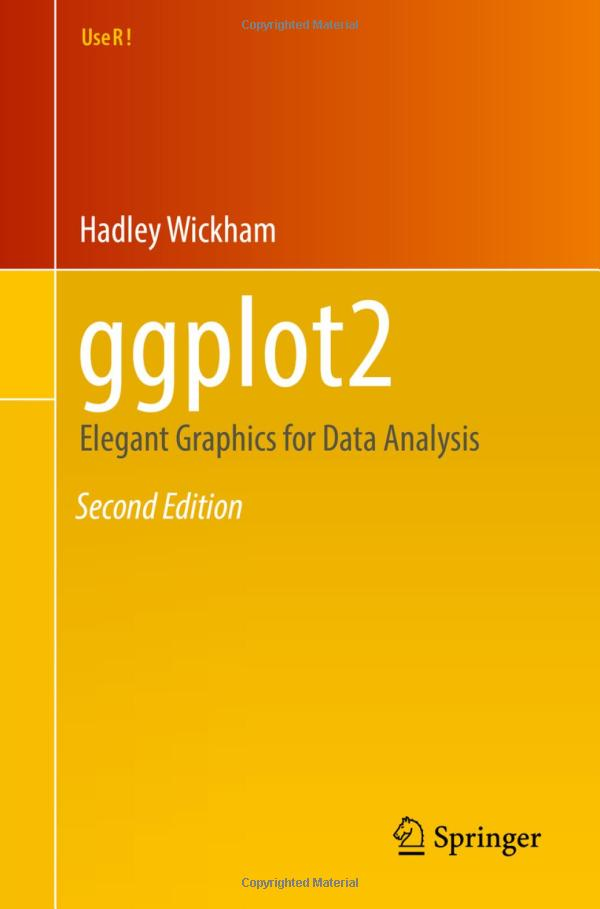

## Outline

- `tidyverse` introduction
- `ggplot2` introduction
- Building plots
  - Aesthetic mappings
  - Geoms
  - Layering
  
```{r setup}
#| echo: false
#| output: false
targets::tar_load(player_stats_csv,
                  store = here::here("_targets"))
```


## The `tidyverse`

:::: {.columns}
::: {.column width="66%"}
What is the `tidyverse`???

[`tidyverse` webpage](https://www.tidyverse.org/){preview-link="true"}

A collection R packages made for data science, all working together in the same "tidy" framework.
:::

::: {.column width="33%"}
[R for Data Science (2e)](https://r4ds.hadley.nz/){target="blank"}

[](https://r4ds.hadley.nz/){target="blank"}
:::
::::

{.absolute bottom=0 left=0 height=40%}


## Whole Game

Pieces of the "whole game" of data science


## Whole Game

Pieces of the "whole game" of data science, with corresponding `tidyverse` packages


{.fragment .absolute right=101.5 bottom=213.8 height=10%}

::: footer
[mareds.github.io/r_course/index.html](https://mareds.github.io/r_course/index.html)
:::


## Import: Today's Dataset

Dataset on player stats from the 2026 World Cup

::: {style="font-size:80%"}

:::: {.columns}
::: {.column width="66%"}
```{r}
#| echo: false
refs <- bibentry(
  bibtype = "Misc",
  author = person(given = "MD Mominul", family = "Islam"),
  title = "The FIFA World Cup 2026 Master Dataset: A Normalized 3NF Relational Benchmark of the Expanded 48-Team International Football Tournament",
  year = "2026",
  publisher = "Zenodo",
  version = "1.0.0",
  doi = "10.5281/zenodo.21592427",
  key = "WorldCup"
)

data_citation <- format(refs, style = "text")

read.csv(here::here("lab", "data", "world_cup_player_stats.csv")) |>
  tibble::tibble() |>
  head(5) |>
  gt::gt()
```
:::

::: {.column width="33%"}

1. Download data onto your computer

2. Move it to where you want it

3. Read it into R

4. Assign it to a variable

::: callout-note
I found this dataset on [Kaggle](https://www.kaggle.com/), a website where people can share datasets (real or simulated). Helpful place to look for interesting datasets!
:::

:::
::::

:::

::: footer
`r data_citation`
:::


## Import: Download Data and Move It

You can access the data through our [class GitHub source page](https://github.com/jhelmer3/PSYC6019-2026)

Also accessible by clicking the GitHub icon on the class website

Navigate to `lab/data/world_cup_player_stats.csv`, and download.

Then, move the `.csv` file to the folder you want it in.

Within your folder for this class, I recommend either having a `data/` subfolder or a subfolder for each lab (e.g., `lab_01/`, `lab_02/`, ...).

{.absolute top=330 right=0 height="10%"}


## Import: Read Data into R

This file is a CSV file, so we can use the `read.csv(file)` function

::: subpoint
`file` = a path to the data file.
:::


## Import: Paths to Files

How do we specify paths to data files?

Sometimes, you'll see something like this

```{r}
#| eval: false
setwd("path/to/a/folder/that/only/works/on/my/computer/my_project_folder")
read.csv("data/my_data.csv")
```

Bad! This will never work on someone else's computer. Or your own computer three months from now, if you decide to change your folder structure.


## Import: Paths to Files

How do we specify paths to data files?

Better: use a tool to automatically find your project root folder, and specify paths with that

Like the `here::here()` function

```{r}
#| eval: false
read.csv(here::here("data", "my_data.csv"))
```

::: fragment
Not part of the `tidyverse`, so we have to install the `here` package next! It was created by the author of the [What They Forgot to Teach You About R](https://rstats.wtf/practice-safe-paths) book.

```{r}
#| eval: false
install.packages("here")
```
:::

::: footer
[What They Forgot to Teach You About R](https://rstats.wtf/practice-safe-paths), [Ode to the `here` Package](https://github.com/jennybc/here_here)
:::


## Aside: Packages in R

Base R has a lot of great stuff, but *packages* made by the community have even more great stuff


## Aside: Packages in R

Steps of using an R package:

#### 1. Installing

`install.packages(package)`

<div class="subpoint">○ `package` = (character) package name </div>

```{r}
#| eval: false
install.packages("here")
```

Only have to do this once


## Aside: Packages in R

Steps of using an R package:

#### 2. Loading

:::: {.columns}

:::{.column}
`library(package)`
<div class="subpoint">○ `package` = (not character) package name </div>

At the top of your file

```{r}
library(here)
```

Better if you use many functions from that package in your script
:::

:::{.column}
`package::package_function()`

```{r}
#| eval: false
here::here()
```

Better if you use only a few functions from that package

Or if you want to be more specific

<div class="subpoint">○ Sometimes a function from one package will overwrite a function from a different package, and this calls the specific one </div>
:::

::::


## Aside: Packages in R

Steps of using an R package:

#### 3. Using

If you use `library()`, you can then call the function with just its name

```{r}
#| eval: false
library(here)

here()
```


## Import: Paths to Files

`here::here()` specifies paths **relatively**, using the `.Rproj` file as the starting point.

```
PSYC6019/
├── PSYC6019.Rproj
├── data/
│   ├── survey_data.csv
│   └── participant_info.csv
├── scripts/
│   ├── clean_data.R
│   └── fit_model.R
├── media/
│   └── results.png
└── reports/
    └── lab_report.qmd
```

How do we access each of these files from each of these starting places?

:::: {.columns style="font-size:66%"}
::: {.column width=33%}
`participant_info.csv` from `clean_data.R`

[`here::here("data", "participant_info.csv")`]{.fragment}
:::

::: {.column width=33%}
`survey_data.csv` to `fit_model.R` 

[`here::here("data", "survey_data.csv")`]{.fragment}
:::

::: {.column width=33%}
`results.png` to `lab_report.qmd` 

[`here::here("media", "lab_report.qmd")`]{.fragment}
:::
::::


## Import: Read Data into R

Let’s do this for real!

```{r}
#| render: !expr function(x, ...) knitr::knit_print(x)
here::here()

here::here("lab", "data", "world_cup_player_stats.csv")

head(read.csv(here::here("lab", "data", "world_cup_player_stats.csv")), 2)
```

Good, we can successfully read in the data. Now, to keep using it, let's assign it to a variable.

```{r}
player_stats <- read.csv(here::here("lab", "data", "world_cup_player_stats.csv"))
```


## Import: Read Data into R

This file is a CSV file, so we can use the `read.csv(file)` function, where `file` is a path to the data file.

```{r}
head(player_stats)
```


## The `tidyverse`

:::: {.columns style="font-size:80%"}

::: {.column width="50%"}
Let's get ready to use some `tidyverse` tools!

We must first install the `tidyverse` with the `install.packages("packagename")` function.

This will install all  packages within the `tidyverse`, so we don't have to install each manually.

You only have to install packages once per R download (and then whenever you want to update a package).

```{r}
#| eval: false
install.packages("tidyverse")
```
:::

::: {.column width="50%"}
To load the `tidyverse` packages into the R environment, we use the `library(package)` function. You will have to run this line once per R session (i.e., every time you restart R).

```{r}
#| message: true
library(tidyverse)
```
:::

::: {.callout-note}
Note the `Conflicts` section! Remember when we talked about overwriting?
:::

::::


## Import: World Cup 2026

Let's get a look at this data...

::: panel-tabset
### `summary()`

Provides descriptive statistics for all columns

```{r}
summary(player_stats)
```

### `str()`

Shows the 'structure' of the data

```{r}
str(player_stats)
```

### `glimpse()`

Shows some information about our data, including variable types

```{r}
# our first `tidyverse` function
glimpse(player_stats)
```
:::


# Whole Game

<span style="color: #C5C5C5;">Import → </span>**Tidy**<span style="color: #C5C5C5;"> → Transform → Visualize → Model → Communicate</span>


## Tidy

Refers to *tidy data*

::: {style="font-size:75%;"}
> "Happy families are all alike; every unhappy family is unhappy in its own way."\
> --- Leo Tolstoy

> "Tidy datasets are all alike, but every messy dataset is messy in its own way."\
> --- Hadley Wickham
:::

Tidy data follow a consistent set of organizational principles

Typically a bit more work up front but **much** easier to work with after

We will discuss tidying data more next week!


# Whole Game

<span style="color: #C5C5C5;">Import → Tidy → </span>**Transform**<span style="color: #C5C5C5;"> → Visualize → Model → Communicate</span>


## Transform

Usually, our data doesn't come to us with the variables exactly as we want them

Sometimes we need...

* New variables, based on our existing data or otherwise

* Summarized version of our dataset

* Reordered variables

We will discuss transforming data more next week!


# Whole Game

<span style="color: #C5C5C5;">Import → Tidy → Transform → </span>**Visualize**<span style="color: #C5C5C5;"> → Model → Communicate</span>


## Visualize

::: {style="font-size:75%;"}
> “The simple graph has brought more information to the data analyst’s mind than any other device.” — John Tukey
:::

We can visualize our data with the `ggplot2` package from the `tidyverse`. `ggplot2` provides a very expansive and flexible plotting system. It is also at the core of a whole ecosystem of `ggplot2` extension packages, meaning so many plotting options are available.


## Visualizations

In statistics, we are often calculating summary statistics: means, medians, SDs, etc.

These are great, but don't trust them alone!

What do you think a dataset with these descriptives would look like?

```{r}
x_mean <- 54.26
y_mean <- 47.83

x_sd <- 16.76
y_sd <- 26.93

cor <- -0.06
```


## Visualizations!

```{r, echo = F}
#| fig-width: 4
#| fig-height: 3
#| fig-align: center
library(tidyverse)

data <- as_tibble(
  MASS::mvrnorm(
    n = 100,
    mu = c(x_mean, y_mean),
    Sigma = matrix(c(17.76, -0.06,
                     -0.06, 26.92), 
                   2, 2)
  )
)

ggplot(data, aes(x = V1, y = V2)) +
  geom_point() +
  geom_text(label = round(mean(data$V1), 2), x = mean(data$V1), y = 35, size = 4) +
  geom_text(label = round(mean(data$V2), 2), x = 42.5, y = mean(data$V2), angle = 90, size = 4) +
  labs(x = "X", y = "Y") +
  coord_cartesian(xlim = c(42.5, 65), ylim = c(35, 60), clip = "off")
```


## Visualizations!

{height=500 fig-align="center"}

::: footer
[research.autodesk.com/publications/same-stats-different-graphs](https://www.research.autodesk.com/publications/same-stats-different-graphs/)
:::


## Visualize: `ggplot2`

Now, let's get to visualizing! Let's explore: what is the relationship between players' positions and the number of goals they score?

:::: {.columns}
::: {.column width=33%}
Let's begin at the end:
:::

::: {.column width=66%}
```{r, echo=F}
#| fig-width: 7
#| fig-height: 5
player_stats$position_fct <- factor(player_stats$position,
                                    levels = c("GK", "DEF", "MID", "FWD"),
                                    labels = c(
                                      "GK" = "Goalkeeper",
                                      "DEF" = "Defense",
                                      "MID" = "Midfield",
                                      "FWD" = "Forward"
                                    ))

player_stats |>
  ggplot(aes(x = goals, fill = position_fct)) +
  geom_bar(aes(y = after_stat(prop))) +
  facet_wrap(~ position_fct) +
  scale_y_continuous("Proportion", limits = 0:1, labels = scales::label_percent()) +
  scale_x_continuous("Goals", breaks = 0:10) +
  guides(x = guide_axis(cap = T),
         y = guide_axis(cap = T)) +
  theme_classic(base_size = 12) +
  labs(title = "2026 World Cup Goals by Player Position",
       caption = "Data from doi.org/10.5281/zenodo.21592427") +
  theme(legend.position = "none",
        plot.title = element_text(size = 20, hjust = 0.5, face = "bold"),
        text = element_text(family = "Roboto"))
```
:::

::::


## Visualize: `ggplot2`

Now, let's get to visualizing! Let's explore: what is the relationship between players' positions and the number of goals they score?

:::: {.columns style="font-size:60%"}

::: {.column width=33%}
When we just call the `ggplot()` function with our data as the first argument, we get this blank area

`ggplot()` works by adding layers and layers onto a plot object

> This is not a very exciting plot, but you can think of it like an empty canvas you’ll paint the remaining layers of your plot onto. — R4DS

:::

::: {.column width=66%}
::: {.panel-tabset}
### Plot
```{r}
#| echo: false
#| fig-width: 7
#| fig-height: 4
ggplot(data = player_stats)
```

### Code
```{r}
#| eval: false
ggplot(data = player_stats)
```
:::
:::

::::


## Visualize: `ggplot2`

Now, let's get to visualizing! Let's explore: what is the relationship between players' positions and the number of goals they score?

:::: {.columns style="font-size:60%"}

::: {.column width=33%}
Next, we want to tell `ggplot()` what information we want in our plot and where we want it

We do this with the `aes()` ("aesthetics") function in the `mapping` argument

How variables are *mapped* onto specific parts of the plot

We can choose to put `goals` on the x-axis.

What do we get?
:::

::: {.column width=66%}
::: {.panel-tabset}
### Plot
```{r}
#| echo: false
#| fig-width: 7
#| fig-height: 4
ggplot(data = player_stats,
       mapping = aes(x = goals))
```

### Code
```{r}
#| eval: false
ggplot(data = player_stats,
       mapping = aes(x = goals))
```
:::
:::

::::


## Visualize: `ggplot2`

Now, let's get to visualizing! Let's explore: what is the relationship between players' positions and the number of goals they score?

:::: {.columns style="font-size:60%"}

::: {.column width=33%}
Still no data, though!

Need to define some **geom**, a geometric display of our data

Will usually start with `geom_`

<div style="font-size:60%">
|   |   |
|---|---|
| `geom_line()` | line graph |
| `geom_bar()` | bar graph |
| `geom_boxplot()` | boxplot |
| `geom_point()` | scatterplot |
</div>
:::

::: {.column width=66%}
::: {.panel-tabset}
### Plot
```{r}
#| echo: false
#| fig-width: 7
#| fig-height: 4.5
ggplot(data = player_stats,
       mapping = aes(x = goals)) +
  geom_bar()
```

### Code
```{r}
#| eval: false
ggplot(data = player_stats,
       mapping = aes(x = goals)) +
  geom_bar()
```
:::
:::

::::


## Visualize: `ggplot2`

Now, let's get to visualizing! Let's explore: what is the relationship between players' positions and the number of goals they score?

:::: {.columns style="font-size:60%"}

::: {.column width=33%}
Can vary the bars by color to show different positions.

Do we need to change the `mapping` or the `geom`?

::: fragment
Can modify the color of a `geom_bar()` by setting the `fill` mapping The `color` mapping is also an option, but that will just change the outline color.
:::
:::

::: {.column width=66%}
::: {.panel-tabset}
### Plot
```{r}
#| echo: false
#| fig-width: 7
#| fig-height: 4.5
ggplot(data = player_stats,
       mapping = aes(x = goals, fill = position)) +
  geom_bar()
```

### Code
```{r}
#| eval: false
ggplot(data = player_stats,
       mapping = aes(x = goals, fill = position)) +
  geom_bar()
```
:::
:::

::::


## Visualize: `ggplot2`

Now, let's get to visualizing! Let's explore: what is the relationship between players' positions and the number of goals they score?

:::: {.columns style="font-size:60%"}

::: {.column width=33%}
So crowded, and so hard to compare between groups! So, let's separate by position.

Can use `facet_wrap(~ grouping_variable)` to make different panels
:::

::: {.column width=66%}
::: {.panel-tabset}
### Plot
```{r}
#| echo: false
#| fig-width: 7
#| fig-height: 4.5
ggplot(data = player_stats,
       mapping = aes(x = goals, fill = position)) +
  geom_bar() +
  facet_wrap(~ position)
```

### Code
```{r}
#| eval: false
ggplot(data = player_stats,
       mapping = aes(x = goals, fill = position)) +
  geom_bar() +
  facet_wrap(~ position)
```
:::
:::

::::


## Data Types Interlude: Factors

New data type (to us): **factor** variable: a built-in data type that R provides for categorical variables

Sets fixed possibilities of values that the variable can take on 

:::: {.columns}
::: {.column}
If you have a variable with days of the week...

```{r}
days <- c("Tues", "Wed", "Thurs")
```

Nothing preventing typos and no sensible sorting

```{r}
moredays <- c("Teus", "Wed", "Thrus")
sort(days)
```
:::

::: {.column .fragment}
Factors help with both. Start by creating a vector of **levels**. Can also make **labels** for nicer printing.

```{r}
weekday_levels <- c("Mon", "Tues", "Wed", "Thurs", "Fri")
weekday_labels <- c("Mon" = "Monday", 
                    "Tues" = "Tuesday", 
                    "Wed" = "Wednesday", 
                    "Thurs" = "Thursday", 
                    "Fri" = "Friday")
```

And now make a factor

```{r}
days_fct <- factor(days, levels = weekday_levels, 
                   labels = weekday_labels)
```
:::
::::


## Transform: Factor Variables

Will convert to `NA` if not valid level

```{r}
factor(moredays, levels = weekday_levels)
```

Better sorting

```{r}
sort(days_fct)
```


## Data Types Interlude: Factors

Within a dataframe, we can modify or create columns by pulling the column out with `$` and assigning it to something new.

```{r}
position_levels <- c("GK", "DEF", "MID", "FWD")
position_labels <- c("GK" = "Goalkeeper",
                     "DEF" = "Defense",
                     "MID" = "Midfield",
                     "FWD" = "Forward")
```

```{r}
player_stats$position_fct <- factor(player_stats$position,
                                    levels = position_levels,
                                    labels = position_labels)
player_stats$position_fct |> head()
```


## Visualize: `ggplot2`

Now, let's get to visualizing! Let's explore: what is the relationship between players' positions and the number of goals they score?

:::: {.columns style="font-size:60%"}

::: {.column width=33%}
Swap `position` to `position_fct`

The absolute number of goals might be a little harder to interpret, though.

We can add a `mapping` argument to `geom_bar()` to tell it to plot proportions instead of counts.
:::

::: {.column width=66%}
::: {.panel-tabset}
### Plot
```{r}
#| echo: false
#| fig-width: 7
#| fig-height: 4.5
ggplot(data = player_stats,
       mapping = aes(x = goals, fill = position_fct, y = after_stat(prop))) +
  geom_bar() +
  facet_wrap(~ position_fct)
```

### Code
```{r}
#| eval: false
ggplot(data = player_stats,
       mapping = aes(x = goals, fill = position_fct, y = after_stat(prop))) +
  geom_bar() +
  facet_wrap(~ position_fct)
```
:::
:::

::::


## Visualize: `ggplot2`

Now, let's get to visualizing! Let's explore: what is the relationship between players' positions and the number of goals they score?

:::: {.columns style="font-size:60%"}

::: {.column width=33%}
Now, we can start tidying this up. Let's make the y-axis have percentage signs with `label_percent()` from the `scales` package, let's make the x-axis only have integers (since goals scored is a count variable) by specifying its `breaks` argument.

With each of these `scales_` functions, we can pass in an scale label as the first argument.
:::

::: {.column width=66%}
::: {.panel-tabset}
### Plot
```{r}
#| echo: false
#| fig-width: 7
#| fig-height: 4.5
ggplot(data = player_stats,
       mapping = aes(x = goals, fill = position_fct)) +
  geom_bar(mapping = aes(y = after_stat(prop))) +
  facet_wrap(~ position_fct) +
  scale_y_continuous("Proportion", limits = 0:1, labels = scales::label_percent()) +
  scale_x_continuous("Goals Scored", breaks = 0:10)
```

### Code
```{r}
#| eval: false
ggplot(data = player_stats,
       mapping = aes(x = goals, fill = position_fct)) +
  geom_bar(mapping = aes(y = after_stat(prop))) +
  facet_wrap(~ position_fct) +
  scale_y_continuous("Proportion", limits = 0:1, labels = scales::label_percent()) +
  scale_x_continuous("Goals Scored", breaks = 0:10)
```
:::
:::

::::


## Visualize: `ggplot2`

Now, let's get to visualizing! Let's explore: what is the relationship between players' positions and the number of goals they score?

:::: {.columns style="font-size:60%"}

::: {.column width=33%}
To help anyone viewing our plot understand it, we can add some labels with the `labs()` function.
:::

::: {.column width=66%}
::: {.panel-tabset}
### Plot
```{r}
#| echo: false
#| fig-width: 7
#| fig-height: 4.5
ggplot(data = player_stats,
       mapping = aes(x = goals, fill = position_fct)) +
  geom_bar(mapping = aes(y = after_stat(prop))) +
  facet_wrap(~ position_fct) +
  scale_y_continuous("Proportion", limits = 0:1, labels = scales::label_percent()) +
  scale_x_continuous("Goals Scored", breaks = 0:10) +
  labs(title = "2026 World Cup Goals by Player Position",
       caption = "Data from doi.org/10.5281/zenodo.21592427")
```

### Code
```{r}
#| eval: false
ggplot(data = player_stats,
       mapping = aes(x = goals, fill = position_fct)) +
  geom_bar(mapping = aes(y = after_stat(prop))) +
  facet_wrap(~ position_fct) +
  scale_y_continuous("Proportion", limits = 0:1, labels = scales::label_percent()) +
  scale_x_continuous("Goals Scored", breaks = 0:10) +
  labs(title = "2026 World Cup Goals by Player Position",
       caption = "Data from doi.org/10.5281/zenodo.21592427")
```
:::
:::

::::


## Visualize: `ggplot2`

Now, let's get to visualizing! Let's explore: what is the relationship between players' positions and the number of goals they score?

:::: {.columns style="font-size:60%"}

::: {.column width=33%}
To improve the overall look of the plot, we can add a `ggplot` theme.

I like increasing the `base_size` argument to improve readability.
:::

::: {.column width=66%}
::: {.panel-tabset}
### Plot
```{r}
#| echo: false
#| fig-width: 7
#| fig-height: 4.5
ggplot(data = player_stats,
       mapping = aes(x = goals, fill = position)) +
  geom_bar(mapping = aes(y = after_stat(prop))) +
  facet_wrap(~ position) +
  scale_y_continuous("Proportion", limits = 0:1, labels = scales::label_percent()) +
  scale_x_continuous("Goals Scored", breaks = 0:10) +
  labs(title = "2026 World Cup Goals by Player Position",
       caption = "Data from doi.org/10.5281/zenodo.21592427") +
  theme_classic(base_size = 12)
```

### Code
```{r}
#| eval: false
ggplot(data = player_stats,
       mapping = aes(x = goals, fill = position_fct)) +
  geom_bar(mapping = aes(y = after_stat(prop))) +
  facet_wrap(~ position_fct) +
  scale_y_continuous("Proportion", limits = 0:1, labels = scales::label_percent()) +
  scale_x_continuous("Goals Scored", breaks = 0:10) +
  labs(title = "2026 World Cup Goals by Player Position",
       caption = "Data from doi.org/10.5281/zenodo.21592427") +
  theme_classic(base_size = 12)
```
:::
:::

::::


## Visualize: `ggplot2`

:::: {.columns style="font-size:60%"}

::: {.column width=33%}
We can use the `theme()` function to further customize our plot.

We can remove the redundant color legend by setting `legend.position` to `"none"`.

We can center and increase the plot title by specifying that it is a text element with `element_text()`, and customizing its `hjust` (horizontal justification) and `size` argument.

I also like to cap the axes with the `guides()` and `guide_axis(cap = T)` function.
:::

::: {.column width=66%}
::: {.panel-tabset}
### Plot
```{r}
#| echo: false
#| fig-width: 7
#| fig-height: 5
ggplot(data = player_stats,
       mapping = aes(x = goals, fill = position_fct)) +
  geom_bar(mapping = aes(y = after_stat(prop))) +
  facet_wrap(~ position_fct) +
  scale_y_continuous("Proportion", limits = 0:1, labels = scales::label_percent()) +
  scale_x_continuous("Goals Scored", breaks = 0:10) +
  labs(title = "2026 World Cup Goals by Player Position",
       caption = "Data from doi.org/10.5281/zenodo.21592427") +
  guides(x = guide_axis(cap = T),
         y = guide_axis(cap = T)) +
  theme_classic(base_size = 12) +
  theme(legend.position = "none",
        plot.title = element_text(size = 20, hjust = 0.5, face = "bold"),
        text = element_text(family = "Roboto"))
```

### Code
```{r}
#| eval: false
ggplot(data = player_stats,
       mapping = aes(x = goals, fill = position_fct)) +
  geom_bar(mapping = aes(y = after_stat(prop))) +
  facet_wrap(~ position_fct) +
  scale_y_continuous("Proportion", limits = 0:1, labels = scales::label_percent()) +
  scale_x_continuous("Goals Scored", breaks = 0:10) +
  labs(title = "2026 World Cup Goals by Player Position",
       caption = "Data from doi.org/10.5281/zenodo.21592427") +
  guides(x = guide_axis(cap = T),
         y = guide_axis(cap = T)) +
  theme_classic(base_size = 12) +
  theme(legend.position = "none",
        plot.title = element_text(size = 20, hjust = 0.5, face = "bold"),
        text = element_text(family = "Roboto"))
```
:::
:::

::::


## Some More `ggplot`s

That was a barplot created with `geom_bar()`, which plots discrete variables. To plot the distribution of continuous variables, we can use a histogram with `geom_histogram()` or a density plot with `geom_density()`. 

::: fragment

:::: {.columns style="font-size:60%"}

::: {.column width=50%}
::: {.panel-tabset}
### Plot
```{r}
#| echo: false
#| fig-width: 7
#| fig-height: 4.5
ggplot(data = player_stats,
       mapping = aes(x = minutes_played)) +
  geom_histogram(binwidth = 30)
```

### Code
```{r}
#| eval: false
ggplot(data = player_stats,
       mapping = aes(x = minutes_played)) +
  geom_histogram(binwidth = 30)
```
:::
:::

::: {.column width=50%}
::: {.panel-tabset}
### Plot
```{r}
#| echo: false
#| fig-width: 7
#| fig-height: 4.5
ggplot(data = player_stats,
       mapping = aes(x = minutes_played)) +
  geom_density()
```

### Code
```{r}
#| eval: false
ggplot(data = player_stats,
       mapping = aes(x = minutes_played)) +
  geom_density()
```
:::
:::

::::

:::


## Some More `ggplot`s

Modify the number of bins in the histogram by either setting `binwidth` (width on the x-axis for each bin) or `bins` (number of bins).

::: fragment

:::: {.columns style="font-size:60%"}

::: {.column width=50%}
`binwidth = 10`

::: {.panel-tabset}
### Plot
```{r}
#| echo: false
#| fig-width: 7
#| fig-height: 4.5
ggplot(data = player_stats,
       mapping = aes(x = minutes_played)) +
  geom_histogram(binwidth = 10)
```

### Code
```{r}
#| eval: false
ggplot(data = player_stats,
       mapping = aes(x = minutes_played)) +
  geom_histogram(binwidth = 10)
```
:::
:::

::: {.column width=50%}
`bins = 15`

::: {.panel-tabset}
### Plot
```{r}
#| echo: false
#| fig-width: 7
#| fig-height: 4.5
ggplot(data = player_stats,
       mapping = aes(x = minutes_played)) +
  geom_histogram(bins = 10)
```

### Code
```{r}
#| eval: false
ggplot(data = player_stats,
       mapping = aes(x = minutes_played)) +
  geom_histogram(binwidth = 10)
```
:::
:::

::::

:::


## Some More `ggplot`s

Violin plots help us easily compare distributions. Create them with `geom_violin()`. Specify the groups on the y-axis by specifying `aes(y = position_fct)`.

:::: {.columns style="font-size:60%"}

::: {.column width=50%}
::: {.panel-tabset}
### Plot
```{r}
#| echo: false
#| fig-width: 7
#| fig-height: 4.5
ggplot(data = player_stats,
       mapping = aes(x = minutes_played, y = position_fct)) +
  geom_violin()
```

### Code
```{r}
#| eval: false
ggplot(data = player_stats,
       mapping = aes(x = minutes_played, y = position_fct)) +
  geom_violin()
```
:::
:::

::::


## Some More `ggplot`s

If we want to layer on the observed data by adding a point plot, do we need to change the `mapping` or the `geom`? [`geom_jitter()`!]{.fragment}

:::: {.columns style="font-size:60%"}

::: {.column width=50%}
::: {.panel-tabset}
### Plot
```{r}
#| echo: false
#| fig-width: 7
#| fig-height: 4.5
ggplot(data = player_stats,
       mapping = aes(x = minutes_played, y = position_fct)) +
  geom_violin()
```

### Code
```{r}
#| eval: false
ggplot(data = player_stats,
       mapping = aes(x = minutes_played, y = position_fct)) +
  geom_violin()
```
:::
:::

::: {.column width=50%}
::: fragment
::: {.panel-tabset}
### Plot
```{r}
#| echo: false
#| fig-width: 7
#| fig-height: 4.5
ggplot(data = player_stats,
       mapping = aes(x = minutes_played, y = position_fct)) +
  geom_violin() +
  geom_jitter()
```

### Code
```{r}
#| eval: false
ggplot(data = player_stats,
       mapping = aes(x = minutes_played, y = position_fct)) +
  geom_violin() +
  geom_jitter()
```
:::
:::
:::

::::


## Some More `ggplot`s

::: {style="font-size:90%"}
An note about `geom_jitter()`: by default it will add noise in both the x- and y-direction (`width` and `height` arguments). This may not be appropriate for all cases: here, the default behavior hides that values in category B are rounded.

```{r}
#| echo: false
d <- tibble(
  category = rep(c("A", "B", "C"), each = 100),
  measurement = round(
    rnorm(300,
          rep(c(10, 10.5, 11), each = 100),
          0.3),
    1
  )
)
```
:::

:::: {.columns style="font-size:60%"}

::: {.column width=50%}
`geom_jitter()`

::: {.panel-tabset}
### Plot
```{r}
#| echo: false
#| fig-width: 7
#| fig-height: 4.5
d |>
  ggplot(aes(x = measurement, y = category)) +
  geom_violin() +
  geom_jitter()
```

### Code
```{r}
#| eval: false
d |>
  ggplot(aes(x = measurement, y = category)) +
  geom_violin() +
  geom_jitter()
```
:::
:::

::: {.column width=50%}
::: fragment
`geom_jitter(width = 0)`

::: {.panel-tabset}
### Plot
```{r}
#| echo: false
#| fig-width: 7
#| fig-height: 4.5
d |>
  ggplot(aes(x = measurement, y = category)) +
  geom_violin() +
  geom_jitter(width = 0)
```

### Code
```{r}
#| eval: false
d |>
  ggplot(aes(x = measurement, y = category)) +
  geom_violin() +
  geom_jitter(width = 0)
```
:::
:::
:::

::::


## Some More `ggplot`s

To plot two continuous variables, we can specify both the x- and y-axes in `aes()` and add a point plot with `geom_point()`. 

:::: {.columns style="font-size:60%"}

::: {.column width=50%}
If we wanted to add a trendline to this, would we need to change the `mapping` or `geom`? [`geom_smooth()`!]{.fragment}
:::

::: {.column width=50%}
::: {.panel-tabset}
### Plot
```{r}
#| echo: false
#| fig-width: 7
#| fig-height: 4.5
ggplot(data = player_stats,
       mapping = aes(x = minutes_played, y = goals)) +
  geom_point()
```

### Code
```{r}
#| eval: false
ggplot(data = player_stats,
       mapping = aes(x = minutes_played, y = goals)) +
  geom_point()
```
:::
:::

::::


## Some More `ggplot`s

We can add a trend line with `geom_smooth()`. Note that `geom_smooth()` picks up the same x and y assignment as already specified in `aes()`.

:::: {.columns style="font-size:60%"}

::: {.column width=50%}
If we wanted to see the points with color representing player position, would we need to change the `mapping` or `geom`? [`aes(color = position_fct)`!]{.fragment}
:::

::: {.column width=50%}
::: {.panel-tabset}
### Plot
```{r}
#| echo: false
#| fig-width: 7
#| fig-height: 4.5
ggplot(data = player_stats,
       mapping = aes(x = minutes_played, y = goals)) +
  geom_point() +
  geom_smooth()
```

### Code
```{r}
#| eval: false
ggplot(data = player_stats,
       mapping = aes(x = minutes_played, y = goals)) +
  geom_point() +
  geom_smooth()
```
:::
:::

::::


## Some More `ggplot`s

If we want to see the points labeled by player position, we can specify the `color` mapping in `aes()`. Also, because `data` is the first argument, we can pipe right into `ggplot()`!

:::: {.columns style="font-size:60%"}

::: {.column width=50%}
::: {.panel-tabset}
### Plot
```{r}
#| echo: false
#| fig-width: 7
#| fig-height: 4.5
ggplot(data = player_stats,
       mapping = aes(x = minutes_played, y = goals, color = position_fct)) +
  geom_point() +
  geom_smooth()
```

### Code
```{r}
#| eval: false
ggplot(data = player_stats,
       mapping = aes(x = minutes_played, y = goals, color = position_fct)) +
  geom_point() +
  geom_smooth()
```
:::
:::

::: {.column width=50%}
::: {.panel-tabset}
### Plot
```{r}
#| echo: false
#| fig-width: 7
#| fig-height: 4.5
ggplot(data = player_stats,
       mapping = aes(x = minutes_played, y = goals, color = position_fct)) +
  geom_point() +
  geom_smooth()
```

### Code
```{r}
#| eval: false
ggplot(data = player_stats,
       mapping = aes(x = minutes_played, y = goals, color = position_fct)) +
  geom_point() +
  geom_smooth()
```
:::
:::

::::


## Visualize: `ggplot2`

Another example of tidying a plot up. Note how similar all the code is!

:::: {.columns style="font-size:60%"}

::: {.column width=33%}
We can use the `theme()` function to further customize our plot.

We can remove the redundant color legend by setting `legend.position` to `"none"`.

We can center and increase the plot title by specifying that it is a text element with `element_text()`, and customizing its `hjust` (horizontal justification) and `size` argument.

I also like to cap the axes with the `guides()` and `guide_axis(cap = T)` function.
:::

::: {.column width=66%}
::: {.panel-tabset}
### Plot
```{r}
#| echo: false
#| fig-width: 7
#| fig-height: 4.5
ggplot(data = player_stats,
       mapping = aes(x = minutes_played, y = goals, 
                     color = position_fct, fill = position_fct)) +
  geom_point() +
  geom_smooth() +
  guides(x = guide_axis(cap = T),
         y = guide_axis(cap = T)) +
  scale_y_continuous(breaks = 0:10) +
  labs(title = "Player Minutes Played vs. Goals Scored",
       subtitle = str_wrap("Stronger Relationship Between Minutes Played and Goals Scored for Attacking Players than Defensive Players"),
       caption = "Data from doi.org/10.5281/zenodo.21592427",
       x = "Minutes Played", y = "Goals", 
       color = "Position", fill = "Position") +
  theme_classic(base_size = 12) +
  theme(legend.position = "inside",
        legend.position.inside = c(.1, .8),
        plot.title = element_text(size = 20, hjust = 0.5, face = "bold"),
        plot.subtitle = element_text(size = 12, hjust = 0.5, face = "italic"),
        text = element_text(family = "Roboto"))
```

### Code
```{r}
#| eval: false
ggplot(data = player_stats,
       mapping = aes(x = minutes_played, y = goals, 
                     color = position_fct, fill = position_fct)) +
  geom_point() +
  geom_smooth() +
  guides(x = guide_axis(cap = T),
         y = guide_axis(cap = T)) +
  scale_y_continuous(breaks = 0:10) +
  labs(title = "Player Minutes Played vs. Goals Scored",
       subtitle = str_wrap("Stronger Relationship Between Minutes Played and Goals Scored for Attacking Players than Defensive Players",
       caption = "Data from doi.org/10.5281/zenodo.21592427"),
       x = "Minutes Played", y = "Goals", 
       color = "Position", fill = "Position") +
  theme_classic(base_size = 12) +
  theme(legend.position = "inside",
        legend.position.inside = c(.1, .8),
        plot.title = element_text(size = 20, hjust = 0.5, face = "bold"),
        plot.subtitle = element_text(size = 12, hjust = 0.5, face = "italic"),
        text = element_text(family = "Roboto"))
```
:::
:::

::::


## Visualizations: Resources

Plotting in `ggplot2` is very powerful and flexible but can take some getting used to. **None** of these functions or arguments need to be memorized. You will always have access to reference material and documentation.

:::: {.columns .smaller-column-images}
::: {.column width="33%"}
[{width="100%"}](https://r4ds.hadley.nz/){target="blank"}
:::

::: {.column width="33%"}
[{width="100%"}](https://ggplot2-book.org//){target="blank"}
:::

::: {.column width="33%"}
[`ggplot2` Documentation](https://ggplot2.tidyverse.org/index.html){target="blank"}
:::
::::


## Removing Missing Data

One more thing (relevant for Homework 1!)

R has a special type for missing data: `NA`. If there are `NA`s in your data, some common functions will not work as expected.

```{r}
test_scores <- c(90, 82, 98, 76, 86, 98, NA, 93, 89)
mean(test_scores); sd(test_scores)
```

Some functions (like these) have an `na.rm` function: tells it to remove the `NA`s before calculating.

```{r}
mean(test_scores, na.rm = T); sd(test_scores, na.rm = T)
```


## Lab 02 Activity

Objectives:

-   Do some basic R!

-   Get familiar with Quarto


