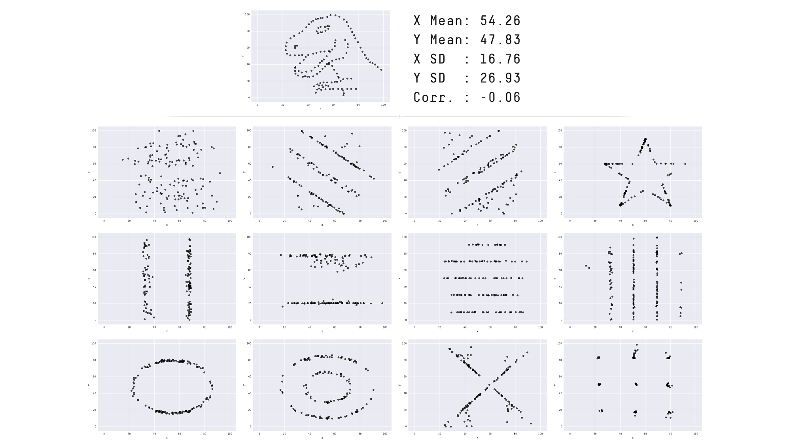

## Outline

- `tidyverse` introduction
- `ggplot2` introduction
- Building plots
  - Aesthetic mappings
  - Geoms
  - Layering
  
```{r setup}
#| echo: false
#| output: false
targets::tar_load(player_stats_csv,
                  store = here::here("_targets"))
```


## The `tidyverse`

:::: {.columns}
::: {.column width="66%"}
What is the `tidyverse`???

[`tidyverse` webpage](https://www.tidyverse.org/){preview-link="true"}

A collection R packages made for data science, all working together in the same "tidy" framework.
:::

::: {.column width="33%"}
[R for Data Science (2e)](https://r4ds.hadley.nz/){target="blank"}

[](https://r4ds.hadley.nz/){target="blank"}
:::
::::

{.absolute bottom=0 left=0 height=40%}


## The `tidyverse`

Let's get ready to use some `tidyverse` code!

To use the `tidyverse` packages, we must first install the `tidyverse` with the `install.packages("packagename")` function. This will install all the packages within the `tidyverse`, so we don't have to install them each manually. You only have to install packages once per R download (and then whenever you want to update a package).

```{r}
#| eval: false
install.packages("tidyverse")
```

To load the `tidyverse` packages into the R environment, we use the `library(package)` function. You will have to run this line once per R session (i.e., every time you restart R).

```{r}
#| message: true
library(tidyverse)
```

::: {.callout-note}
Note the `Conflicts` section! Remember when we talked about overwriting?
:::


## Whole Game

Pieces of the "whole game" of data science


## Whole Game

Pieces of the "whole game" of data science, with corresponding `tidyverse` packages


{.fragment .absolute right=88.3 bottom=208 height=9%}

::: footer
[mareds.github.io/r_course/index.html](https://mareds.github.io/r_course/index.html)
:::


## Import: Today's Dataset

Dataset on player stats from the 2026 World Cup

::: {style="font-size:80%"}

:::: {.columns}
::: {.column width="66%"}
```{r}
#| echo: false
refs <- bibentry(
  bibtype = "Misc",
  author = person(given = "MD Mominul", family = "Islam"),
  title = "The FIFA World Cup 2026 Master Dataset: A Normalized 3NF Relational Benchmark of the Expanded 48-Team International Football Tournament",
  year = "2026",
  publisher = "Zenodo",
  version = "1.0.0",
  doi = "10.5281/zenodo.21592427",
  key = "WorldCup"
)

data_citation <- format(refs, style = "text")

read.csv(here::here("lab", "data", "world_cup_player_stats.csv")) |>
  tibble::tibble() |>
  head()
```
:::

::: {.column width="33%"}

1. Download data onto your computer

2. Move it into the location you want

3. Read it into R

4. Assign it to a variable
:::
::::

:::

::: footer
`r data_citation`
:::


## Import: Download Data and Move It

You can access the data through our [class GitHub source page](https://github.com/jhelmer3/PSYC6019-2026)

Also accessible by clicking the GitHub icon on the class website

Navigate to `lab/data/world_cup_player_stats.csv`, and download.

Then, move the `.csv` file to the folder you want it in.

I recommend either having a `data/` subfolder or a subfolder for each lab (e.g., `lab_01/`, `lab_02/`, ...).

{.absolute top=330 right=0 height="10%"}


## Import: Read the Data into R

This file is a CSV file, so we can use the `read.csv(file)` function, where `file` is a path to the data file.


## Import: Paths to Files

How do we specify paths to data files?

Sometimes, you'll see something like this

```{r}
#| eval: false
setwd("specific/path/to/a/folder/that/only/works/on/my/computer/my_project")
read.csv("data/my_data.csv")
```

Bad! This will never work on someone else's computer. Or your own computer three months from now, if you decide to change your folder structure.


## Import: Paths to Files

How do we specify paths to data files?

Better: use a tool to automatically find your project root folder, and specify paths with that

Like the `here::here()` function

```{r}
#| eval: false
read.csv(here::here("data", "my_data.csv"))
```


## Import: Read the Data into R

This file is a CSV file, so we can use the `read.csv(file)` function, where `file` is a path to the data file.

```{r}
here::here()

read.csv(here::here("lab", "data", "world_cup_player_stats.csv"))
```

Good, we can successfully read in the data. Now, to keep using it, let's assign it to a variable.

```{r}
player_stats <- read.csv(here::here("lab", "data", "world_cup_player_stats.csv"))
```


## Import: Read the Data into R

This file is a CSV file, so we can use the `read.csv(file)` function, where `file` is a path to the data file.

```{r}
head(player_stats)
```


## Import: World Cup 2026

Let's get a look at this data...

::: panel-tabset
### `summary()`

Provides descriptive statistics for all columns

```{r}
summary(player_stats)
```

### `str()`

Shows the 'structure' of the data

```{r}
str(player_stats)
```

### `glimpse()`

Shows some information about our data, including variable types

```{r}
# our first `tidyverse` function
glimpse(player_stats)
```
:::


# Whole Game

<span style="color: #C5C5C5;">Import → </span>**Tidy**<span style="color: #C5C5C5;"> → Transform → Visualize → Model → Communicate</span>


## Tidy

Refers to *tidy data*

::: {style="font-size:75%;"}
> "Happy families are all alike; every unhappy family is unhappy in its own way."\
> --- Leo Tolstoy

> "Tidy datasets are all alike, but every messy dataset is messy in its own way."\
> --- Hadley Wickham
:::

Tidy data follow a consistent set of organizational principles

Typically a bit more work up front but **much** easier to work with after


## Tidy

:::: {.columns style="font-size:70%"}
::: {.column width=32%}
```{r, echo=F}
player_stats |>
  select(player_name, minutes_played, assists, goals) |>
  head()
```
:::

::: {.column width=2%}
<!-- spacing -->
:::

::: {.column .fragment .fade-out width=32% data-fragment-index="1"}
```{r, echo=F}
player_stats |>
  select(player_name, minutes_played, assists, goals) |>
  pivot_longer(c(assists, goals), 
               names_to = "type", values_to = "count") |>
  head()
```
:::

::: {.column width=2%}
<!-- spacing -->
:::

::: {.column .fragment .fade-out width=32% data-fragment-index="1"}
```{r, echo=F}
player_stats |>
  select(player_name, minutes_played, assists, goals) |>
  mutate(assists_to_goals = paste0(assists, ":", goals),
         .keep = "unused") |>
  head()
```
:::
::::

All of these dataframes contain the same information, but one of them is much easier to work with...

::: fragment
Why?
:::


## Tidy: Principles

Three rules to a tidy dataset

1. Each variable is a column; each column is a variable.

2. Each observation is a row; each row is an observation.

3. Each value is a cell; each cell is a single value.


::: footer
<https://r4ds.hadley.nz/data-tidy.html#fig-tidy-structure>
:::


## Tidy: Why Tidy?

1. Consistency! Any sort of consistency in your data management will be beneficial.

::: fragment
2. R loves vectors! Having variables in columns plays well with many functions
:::


## Tidy: Is Our Data Tidy?

:::: {.columns style="font-size:70%"}
::: {.column width=70%}
```{r}
head(player_stats, n = 10)
```
:::

::: {.column width=30%}
1. Each variable is a column; each column is a variable.

2. Each observation is a row; each row is an observation.

3. Each value is a cell; each cell is a single value.
:::
::::


## Tidy: For Later...

We will learn ways to make untidy data tidy in later classes

For now, we are good, and can proceed with our work!


# Whole Game

<span style="color: #C5C5C5;">Import → Tidy → </span>**Transform**<span style="color: #C5C5C5;"> → Visualize → Model → Communicate</span>


## Transform

Usually, our data doesn't come to us with the variables exactly as we want them

Sometimes we need...

* New variables, based on our existing data or otherwise

* Summarized version of our dataset

* Reordered variables

* Etc., etc., etc. Any others?


## Transform: `tidyverse` syntax 

The `tidyverse` website mentioned that each package shares a common language for their functions

Based off of `dplyr` (one of the packages) verbs

1. The first argument is always a dataframe.

2. The subsequent arguments typically describe which columns to operate on using the variable names (without quotes).

3. The output is always a new data frame.

::: footer
<https://r4ds.hadley.nz/data-transform.html#dplyr-basics>
:::


## Transform: More `tidyverse` syntax 

One more thing...

`tidyverse` verbs work best in a **pipe**: |>

:::: {.columns}
::: {.column}
How we've been using functions:

`output <- function(input)`
:::

::: {.column}
Functions in a pipe:

`output <- input |> function()`
:::
::::

Why is this helpful?

:::: {.columns}
::: {.column .fragment}
Many functions together:

```
another_function(other_function(function(input)))
```
:::

::: {.column .fragment}
Functions in a pipe:

```
input |>
  function() |>
  other_function() |>
  another_function()
```
:::
::::


## Transform: Goals For Our Data

My questions: 

1. What team had the most goals overall?

2. What goalie had the highest saves per match played?

3. Class question!! (time pending)


## Transform: Functions

A core few of the `tidyverse` functions...

::: panel-tabset
### `select()`

`select(df, columns)`

Selects just the columns you specify. Helpful for paring down the data for easy viewing.

```{r}
player_minutes_played <- player_stats |>
  select(player_name, minutes_played) 

player_minutes_played |>
  head()
```

### `mutate()`

`mutate(df, new_column = ...)`

Adds new columns to the dataframe, either from scratch or based on existing columns.

```{r}
player_minutes_played |>
  mutate(hours_played = minutes_played / 60,
         hours_played_rounded = round(hours_played, 2)) |>
  head()
```

### `filter()`

::: panel-tabset
### Code Example

:::: {.columns}
::: {.column width="50%"}
`filter(df, condition_to_keep)`

```{r}
player_minutes_played |>
  filter(minutes_played > quantile(minutes_played, probs = .99)) |>
  head()
```
:::

::: {.column width="50%"}
`filter_out(df, condition_to_keep)` does the opposite (as you'd expect by the name)

```{r}
player_minutes_played |>
  nrow()

player_minutes_played |>
  filter_out(minutes_played == 0) |>
  nrow()
```
:::
::::

### Logical Operators

| Symbol | Meaning                   |
|--------|---------------------------|
| `==`   | equal to                  |
| `!=`   | not equal to              |
| `<`    | less than                 |
| `<=`   | less than or equal to     |
| `>`    | greater than              |
| `>=`   | greater than or equal to  |

:::

### `summarize()`

`summarize(df, .by = optional_grouping_variable, new_column = ...)`

:::: {.columns}

::: {.column width="50%"}
```{r}
player_minutes_played |>
  summarize(mean = mean(minutes_played),
            median = median(minutes_played),
            min  = min(minutes_played),
            max = max(minutes_played))
```
:::

::: {.column width="50%"}
```{r}
player_stats |>
  summarize(.by = team_name,
            total_minutes_played = sum(minutes_played)) |>
  head()
```

:::

::::

:::


## Transform: Questions

1. What team had the most goals overall?

```{r}
total_goals_df <- player_stats |>
  summarize(.by = team_name,
            total_goals = sum(goals))

total_goals_df |>
  arrange(desc(total_goals))

total_goals_df |>
  filter(total_goals == max(total_goals))
```


## Transform: Questions

2. What goalie had the highest saves per match played?

```{r}
player_stats$position |> unique()

player_stats |>
  filter(when_all(position == "GK",
                  matches_played > 0)) |>
  select(team_name, player_name, saves, matches_played) |>
  mutate(saves_per_match = saves / matches_played) |>
  arrange(desc(saves_per_match))
```


## Transform: Questions

3. Class question!! (time pending)


# Whole Game

<span style="color: #C5C5C5;">Import → Tidy → Transform → </span>**Visualize**<span style="color: #C5C5C5;"> → Model → Communicate</span>


## Visualize

So many numbers! Can we please visualize our data?

::: {style="font-size:75%;"}
> “The simple graph has brought more information to the data analyst’s mind than any other device.” — John Tukey
:::

Yes! With the `ggplot2` package. `ggplot2` provides a very expansive and flexible plotting system. It is also at the core of a whole ecosystem of `ggplot2` extension packages, meaning so many plotting options are available.


## Visualizations

In statistics, we are often calculating summary statistics: means, medians, SDs, etc.

These are great, but don't trust them alone!

What do you think a dataset with these descriptives would look like?

```{r}
x_mean <- 54.26
y_mean <- 47.83

x_sd <- 16.76
y_sd <- 26.93

cor <- -0.06
```


## Visualizations!

```{r, echo = F}
#| fig-width: 4
#| fig-height: 3
#| fig-align: center
library(tidyverse)

data <- as_tibble(
  MASS::mvrnorm(
    n = 100,
    mu = c(x_mean, y_mean),
    Sigma = matrix(c(17.76, -0.06,
                     -0.06, 26.92), 
                   2, 2)
  )
)

ggplot(data, aes(x = V1, y = V2)) +
  geom_point() +
  geom_text(label = round(mean(data$V1), 2), x = mean(data$V1), y = 35, size = 8) +
  geom_text(label = round(mean(data$V2), 2), x = 42.5, y = mean(data$V2), angle = 90, size = 8) +
  labs(x = "X", y = "Y") +
  coord_cartesian(xlim = c(42.5, 65), ylim = c(35, 60), clip = "off")
```


## Visualizations!

{height=500 fig-align="center"}

::: footer
https://www.research.autodesk.com/publications/same-stats-different-graphs/
:::


## Visualize: `ggplot2`

Now, let's explore a different question: what is the relationship between players' positions and the number of goals they score?

:::: {.columns}
::: {.column width=33%}
Let's begin at the end:
:::

::: {.column width=66%}
```{r, echo=F}
#| fig-width: 5
#| fig-height: 4
position_labels = c(
  "GK" = "Goalkeeper",
  "DEF" = "Defense",
  "MID" = "Midfield",
  "FWD" = "Forward"
)

player_stats |>
  ggplot(aes(x = goals, fill = position)) +
  geom_bar(aes(y = after_stat(prop))) +
  facet_wrap(~ position, labeller = as_labeller(position_labels)) +
  scale_y_continuous("Proportion", limits = 0:1, labels = scales::label_percent()) +
  scale_x_continuous("Goals", breaks = 0:10) +
  guides(x = guide_axis(cap = T),
         y = guide_axis(cap = T)) +
  theme_classic(base_size = 12) +
  labs(title = "2026 World Cup Goals by Player Position",
       caption = "Data from doi.org/10.5281/zenodo.21592427") +
  theme(legend.position = "none",
        plot.title = element_text(size = 20, hjust = 0.5, face = "bold"),
        text = element_text(family = "Roboto"))
```
:::

::::


## Visualize: `ggplot2`

Now, let's explore a different question: what is the relationship between players' positions and the number of goals they score?

:::: {.columns style="font-size:60%"}

::: {.column width=33%}
When we just call the `ggplot()` function with our data as the first argument, we get this blank area

`ggplot()` works by adding layers and layers onto a plot object

> This is not a very exciting plot, but you can think of it like an empty canvas you’ll paint the remaining layers of your plot onto. — R4DS

:::

::: {.column width=66%}
::: {.panel-tabset}
### Plot
```{r}
#| echo: false
#| fig-width: 6
#| fig-height: 5
ggplot(data = player_stats)
```

### Code
```{r}
#| eval: false
ggplot(data = player_stats)
```
:::
:::

::::


## Visualize: `ggplot2`

Now, let's explore a different question: what is the relationship between players' positions and the number of goals they score?

:::: {.columns style="font-size:60%"}

::: {.column width=33%}
Next, we want to tell `ggplot()` what information we want in our plot and where we want it

We do this with the `aes()` ("aesthetics") function in the `mapping =` argument

How variables are *mapped* onto specific parts of the plot

To investigate the relationship between the first and second pulse measurements, we can choose to put `goals` on the x-axis.

What do we get?
:::

::: {.column width=66%}
::: {.panel-tabset}
### Plot
```{r}
#| echo: false
#| fig-width: 5
#| fig-height: 5
ggplot(data = player_stats,
       mapping = aes(x = goals))
```

### Code
```{r}
#| eval: false
ggplot(data = player_stats,
       mapping = aes(x = goals))
```
:::
:::

::::
