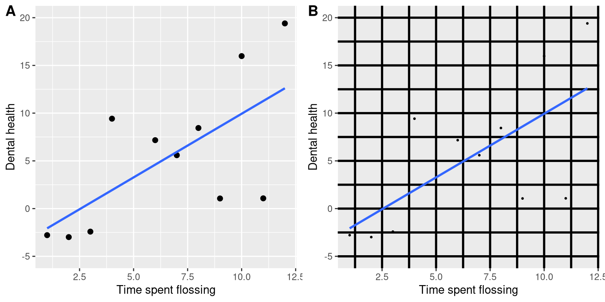
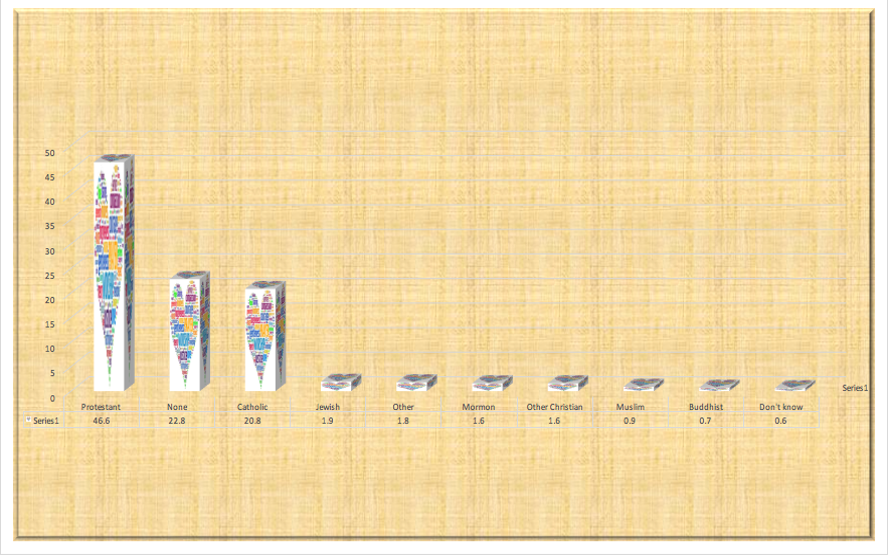
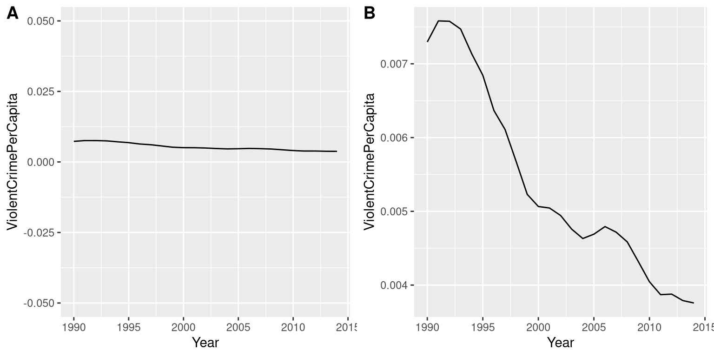
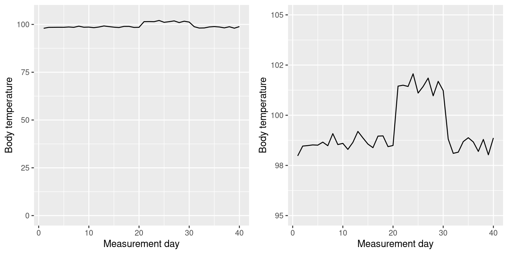
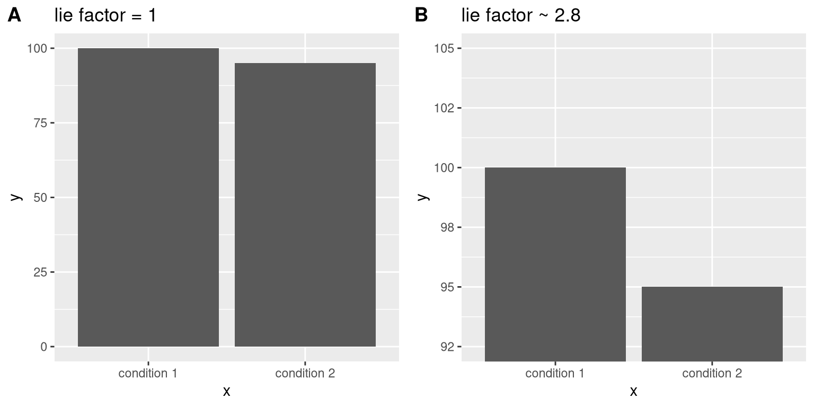

```{r}
#| echo: false


library(knitr)
library(formatR)
library(tidyverse)
opts_chunk$set(out.width = '100%', options(width=60))

opts_knit$set(global.par = TRUE)
opts_chunk$set(echo=FALSE, warning = FALSE, message = FALSE, comment = '', class.output='sh',
               fig.width=8, fig.height=5, fig.align = "center")

my_red <- "#E41A1C"
my_blue <- "#377EB8"
my_green <- "#4DAF4A"
my_purple <- "#984EA3"
my_orange <- "#FF7F00"
my_yellow <- "#FFFF33"
my_red2 <- "#FBB4AE" 
my_blue2 <- "#B3CDE3" 
my_green2 <- "#CCEBC5" 
my_purple2 <- "#DECBE4"
my_orange2 <- "#FED9A6"
my_yellow2 <- "#FFFFCC"

```

```{r}

bball <- read.csv("../../data/2026NBA_data.csv") |> filter(G >= max(G)/2,
                                                draft_year != "")
```

## Data Visualization

This lecture will discuss....

From Poldrack:

-   General principles of good data visualization

From me:

-   Types of plots for summarizing discrete data
-   Types of plots for summarizing continuous data

## The Data/Ink Ratio

Edmund Tufte proposed maximizing the following general guideline:

$$\text{data/ink ratio} = \frac{\text{amount of ink used on data}}{\text{total ink used}}$$

-   Minimize visual clutter
-   Avoid Chartjunk
-   Ensure the data speaks
-   Only use extra plot features to help emphasize relevant features of the data

## The Data/Ink Ratio



## Identifying Chartjunk



## Chartjunk Answers

-   [Weird graphics overlaid on bars]{.answer .fragment .content-visible unless-meta="params.v0"}
-   [Unnecessarily textured background]{.answer .fragment .content-visible unless-meta="params.v0"}
-   [3D bars might distort the data]{.answer .fragment .content-visible unless-meta="params.v0"}

## Axis Distortions

Choosing the appropriate scale for chart axes is one of the most important decisions in appropriately representing data.

The following slides will show some examples of pairs of graphs of the same data.

- How do they differ?

- Which do you think is the better representation of the data?

## Violent Crime per Capita



## Temperature



## Lie Factor (?)



## Answers

**Violent Crime**

-   [Can violent crime be negative?]{.answer .fragment .content-visible unless-meta="params.v0"}
-   [What amount of change in violent crime would matter? Do you care about a change from .007 (0.7%) to .004 (0.4%)?]{.answer .fragment .content-visible unless-meta="params.v0"}

**Body Temperature**

-   [Is a zero point meaningful here?]{.answer .fragment .content-visible unless-meta="params.v0"}
-   [We probably want to know if the temperature changes from high 90s to low 100s!]{.answer .fragment .content-visible unless-meta="params.v0"}

## The Lie Factor

Also proposed by Tufte

$$\text{lie factor} = \frac{\text{size of effect in graphic}}{\text{actual size of effect}}$$

Where, in our example

-   **Size of effect in graphic:** Difference in area between the two bars
-   **Actual size of effect:** Numerical difference between two bars

The difference in areas in the second panel is 2.8x as large as the numerical difference. This is misleading!


## Principles of Axis Scaling

::: {style="font-size: 0.9em;"}

One of the most common mistakes I see in creating graphs

-   Software will often default to the range of values **being graphed**
-   Axis should represent a **plausible range of values of data**
    -   If you are comparing multiple means, you often need to expand the axis range!
        - **Reasonable heuristic:** Use the observed range or IQR of values of a variable
-   Almost always important to think about on $y$-axis
-   Sometimes important to think about on $x$-axis
-   Don't "zoom in" to exaggerate the size of an effect
-   Don't "zoom out" to de-emphasize size of effect
-   Scale should be chosen such that it reasonably represents effect size
    -   More on effect sizes later

::: 

## Types of Data and Graphs


Discrete data

-   Bar charts

Continuous data

-   Histograms
-   Kernel Density Plots
-   Box plots
-   Violin Plots
-   Beeswarms


## 2026 NBA Data

```{r}
#| echo: TRUE
bball <- read.csv("../../data/2026NBA_data.csv") |> filter(G >= max(G)/2,
                                                draft_year != "")
bball |> glimpse()
```

## 2026 NBA Data Sources

-   [Basketball Reference 2026 season statistics](https://www.basketball-reference.com/leagues/NBA_2026_totals.html)
-   [Kaggle dataset with demographic data on players through 2021](https://www.kaggle.com/datasets/justinas/nba-players-data/data)
    -   Means we are missing demographic data on some younger players
    -   I removed these players from our dataset for simplicity


## Discrete Data: Bar Charts

If I want to plot the number of players at each position, this is the default I get in `ggplot2`. How can I make this better?

```{r}
ggplot(bball, aes(x = Pos)) + geom_bar()


```

## Better Bar Chart

```{r}

bball$Position <- ifelse(bball$Pos == "C","Center",
                         ifelse(bball$Pos == "PF", "Power Forward",
                                ifelse(bball$Pos == "PG", "Point Guard",
                                       ifelse(bball$Pos == "SF", "Small Forward",
                                              "Shooting Guard"))))

bball$Position <- factor(bball$Position, levels = c("Point Guard","Shooting Guard","Small Forward",
                         "Power Forward","Center"))

ggplot(bball, aes(x = Position, fill = Position)) + geom_bar() + 
  xlab("Position") + ylab("Number of Players") + 
  scale_y_continuous(limits = c(0,75), breaks = seq(0, 75, 5)) +
  scale_fill_viridis_d() +
  theme_minimal() +
    theme(axis.text.x = element_text(angle = 45, vjust = 1, hjust = 1),
          legend.position = "none")

```

## Important Changes


-   Informative labels
-   Made x-axis labels diagonal so they are readable but don't overlap
-   Set a scale for the y-axis
    -   If you don't do this, it will only go as large as it needs to and no larger
-   Added enough horizontal reference lines to make the values clear
-   While color wasn't necessary, I chose a colorblind friendly palette
    -   Focuses on contrast rather than hue
-   I ordered the x-axis in a sensible way. 
    - Point guards are usually the smallest players, centers the biggest
    -   I could have also done something like this (arguably better!):


## Ordered By Count

```{r}

bball$Position <- factor(bball$Position, levels = c("Shooting Guard","Center","Point Guard","Small Forward","Power Forward"))

ggplot(bball, aes(x = Position, fill = Position)) + geom_bar() + 
  xlab("Position") + ylab("Number of Players") + 
  scale_y_continuous(limits = c(0,75), breaks = seq(0, 75, 5)) +
  scale_fill_viridis_d() +
  theme_minimal() +
    theme(axis.text.x = element_text(angle = 45, vjust = 1, hjust = 1),
          legend.position = "none")

```

## What About This?

:::: {style="font-size: 0.65em;"}
```{r out.width = "75%"}
ggplot(bball, aes(x = "", fill = Position)) + 
  geom_bar(width = 1) + 
  coord_polar(theta = "y") + 
  scale_fill_viridis_d() + 
  theme_void() + 
  labs(fill = "Position")
```

::: {style="margin-top: -30px;"}
[Can you tell from this graph whether there were more point guards or power forwards?]{.answer .fragment .content-visible unless-meta="params.v0"}

[Avoid pie charts!]{.answer .fragment .content-visible unless-meta="params.v0"}
:::
::::

## Continuous Data

With continuous data, we have a huge amount of flexibility in how we construct visuals.

-   In statistics, we often want to compare the **means** of different groups
-   A natural way to do this is to take our bar graphs and use them to show the means

## Bar Graphs for Means

```{r}
bball$Position <- factor(bball$Position, levels = c("Shooting Guard","Center","Point Guard","Small Forward","Power Forward"))


ggplot(bball, aes(x = Position, y = PTS, fill = Position)) +
  geom_bar(stat = "summary", fun = "mean") + 
  xlab("Position") + ylab("Average Points Per Game") + 
  scale_y_continuous(limits = c(0,20), breaks = seq(0, 20, 2)) +
  scale_fill_viridis_d() +
  theme_minimal() +
    theme(axis.text.x = element_text(angle = 45, vjust = 1, hjust = 1),
          legend.position = "none")
```

## Thoughts?


What does the mean tell you?

- [The mean is a measure of *centrality*]{.answer .fragment .content-visible unless-meta="params.v0"}

What do the bars imply?

- [Bars imply there is a difference between values below the bar (colored) and above the bar (not colored)]{.answer .fragment .content-visible unless-meta="params.v0"}

[**The-Bar Tip Limit Error:** About one in five people interpret the top of a bar to indicate a *limit* even when it is meant to indicate an *average*]{.answer .fragment .content-visible unless-meta="params.v0"}

[**Bar charts are inappropriate for continuous data!**]{.answer .fragment .content-visible unless-meta="params.v0"}

::: {style="font-size: 0.6em;"}
[Kerns, S. H., & Wilmer, J. B. (2021). Two graphs walk into a bar: Readout-based measurement reveals the Bar-Tip Limit error, a common, categorical misinterpretation of mean bar graphs. *Journal of Vision*, *21*(12), Article 17. <https://doi.org/10.1167/jov.21.12.17>]{.answer .fragment .content-visible unless-meta="params.v0"}
:::

## Point Means

If you **must** create a visual that just has the mean, don't use bars

- Use single points to represent the mean
- Consider including something that represents the precision of the measurement
    - Standard error
    - 95% confidence interval
    - Be explicit about which one you use
    - We haven't discussed these yet, but we will!


## Means and 95% CIs

```{r}
library(ggeffects)
lm1 <- lm(PTS ~ Position, bball)

ggp1 <- ggpredict(lm1, "Position")
ggp1 <- as.data.frame(ggp1)
ggplot(ggp1, aes(x = x, y = predicted, color = x)) + geom_point(size = 3) +
  geom_errorbar(aes(ymin = conf.low, ymax = conf.high), size = 1, width = .2)  +
  scale_y_continuous(limits = c(0,20), breaks = seq(0, 20, 2)) +
  scale_color_viridis_d() +
  theme_minimal() +
  labs(x = "Position", y = "Average Points Per Game") +
    theme(axis.text.x = element_text(angle = 45, vjust = 1, hjust = 1),
          legend.position = "none")
```
## Beyond Means

Plotting means has its place, especially for **inference**

- Help us see how groups differ on average
- Help us understand the extent to which one group differs from another on average

But data viz can do so much more than just help us visualize means

- We often want to plot **distributions**

## Histograms

Histograms look a bit *like* bar charts, but they are different

-   Meant to represent **full distribution of data**
    -   Not averages!
-   Group values into equal-interval "bins"
-   Histograms show the frequency of observations in each bin

## Histogram of PPG

```{r}
ggplot(bball, aes(x = PTS)) +
  geom_histogram(fill = "steelblue") + 
  xlab("Points Per Game (All Positions)") + ylab("Frequency") + 
  theme_minimal()
```

## Choosing Bins

`ggplot2` defaults to 30 bins regardless of the data, but you should think more carefully!

-   Too few bins will mask the shape of the distribution
-   Too many bins will look jagged and hard to read
-   Trial and error is OK!
-   Sturges' rule:
    -   Number of bins = $1 + \text{log}_2(N)$
    -   Width of bins = $\frac{\text{max} - \text{min} + 1}{\text{number of bins}}$

## Too few bins

```{r}

ggplot(bball, aes(x = PTS)) +
  geom_histogram(fill = "steelblue", bins = 3) + 
  xlab("Points Per Game (All Positions)")  + ylab("Frequency") + 
  theme_minimal()
```

## Too many bins

```{r}

ggplot(bball, aes(x = PTS)) +
  geom_histogram(fill = "steelblue", bins = 500) + 
  xlab("Points Per Game (All Positions)")  + ylab("Frequency") + 
  theme_minimal()
```

## Sturges Bins

```{r}

n_bins <- ceiling(1 + log2(nrow(bball)))

ggplot(bball, aes(x = PTS)) +
  geom_histogram(fill = "steelblue", bins = n_bins) + 
  xlab("Points Per Game (All Positions)")  + ylab("Frequency") + 
  theme_minimal()
```

## Kernel Density Plot


Kernel density plots produce a **smooth curve** of a distribution

-   Horizontal axis ($x$-axis): values

-   Vertical axis ($y$-axis): density/frequency

Conceptually:

-   Sort scores on the $x$-axis

-   Assume that **every** value represents an underlying distribution (kernel function) 
    - E.g. every value is treated as a separate normal distribution
    
-   Kernel density function sums these underlying distributions


## Kernel Density Plot

```{r}
dnorm8 <- function(x, mean = 0, sd = 1) dnorm(x = x, mean = mean, sd = sd) / 8

ggplot(data.frame(x = c(1.63, 1.99)), aes(x)) +
  stat_function(fun = dnorm8, args = list(mean = 1.65, sd = .04)) +
  stat_function(fun = dnorm8, args = list(mean = 1.84, sd = .04)) +
  stat_function(fun = dnorm8, args = list(mean = 1.89, sd = .04)) +
  stat_function(fun = dnorm8, args = list(mean = 1.90, sd = .04)) +
  stat_function(fun = dnorm8, args = list(mean = 1.92, sd = .04)) +
  stat_function(fun = dnorm8, args = list(mean = 1.82, sd = .04)) +
  stat_function(fun = dnorm8, args = list(mean = 1.78, sd = .04)) +
  stat_function(fun = dnorm8, args = list(mean = 1.75, sd = .04)) +
  lims(y = c(0, 4.5), x = c(1.63, 1.99)) + theme_light() +
  theme(axis.text.y = element_blank(), 
        plot.title = element_text(hjust = 0.5, size = 18)) +
  labs(x = "Height (m)", y = "Density", title = "kernel function: normal density around each point")
```

## Kernel Density Plot

```{r}
ggplot(data.frame(x =c(1.65, 1.84, 1.89, 1.90,
                       1.92, 1.82, 1.78, 1.75)), aes(x)) +
  geom_density(kernel = "gaussian", bw = .04, col = my_blue, size = I(2)) +
  stat_function(fun = dnorm8, args = list(mean = 1.65, sd = .04)) +
  stat_function(fun = dnorm8, args = list(mean = 1.84, sd = .04)) +
  stat_function(fun = dnorm8, args = list(mean = 1.89, sd = .04)) +
  stat_function(fun = dnorm8, args = list(mean = 1.90, sd = .04)) +
  stat_function(fun = dnorm8, args = list(mean = 1.92, sd = .04)) +
  stat_function(fun = dnorm8, args = list(mean = 1.82, sd = .04)) +
  stat_function(fun = dnorm8, args = list(mean = 1.78, sd = .04)) +
  stat_function(fun = dnorm8, args = list(mean = 1.75, sd = .04)) +
  lims(y = c(0, 4.5), x = c(1.63, 1.99)) +
  theme_light() +
  theme(axis.text.y = element_blank(), 
        plot.title = element_text(hjust = 0.5, size = 18)) +
  labs(x = "Height (m)", y = "Density", title = "normal density around each point and kernel density")
```

## Kernel Density Plot

::: {style="font-size: 0.925em;"}
Two Considerations:

Kernel function:

-   Assumed distribution of each value

-   Two common options: normal and Epanechnikov

-   Epanechnikov kernel function is the most efficient method for kernel density plot

Width or Bandwidth:

-   A parameter that smooths the kernel density curve

-   Larger bandwidth $\rightarrow$ smoother curve

-   Too much smoothing can lose too much information

-   Rules of thumb given by Silverman (`ggplot2` default, pretty smart!), Scott, others
:::

## Kernel Density Plot

```{r}
p1 <- ggplot(bball) +
  geom_density(aes(x = PTS), na.rm = TRUE, col = my_purple, kernel = "gaussian", bw = "nrd0") + scale_x_continuous(n.breaks = 10) +
  labs(y = "density", x = "Points Per Game", title = "Gaussian kernel, Silverman bw") + theme_light() + theme(plot.title = element_text(size = 12, hjust = 0.5))
p2 <- ggplot(bball) +
  geom_density(aes(x = PTS), na.rm = TRUE, col = my_blue, kernel = "epanechnikov", bw = "nrd0") + scale_x_continuous(n.breaks = 10) + labs(y = "density", x = "Points Per Game", title = "Epanechnikov kernel, Silverman bw") + theme_light() + theme(plot.title = element_text(size = 12, hjust = 0.5))

p3 <- ggplot(bball) +
  geom_density(aes(x = PTS), na.rm = TRUE, col = my_purple, kernel = "gaussian", bw = .4) + labs(y = "density", x = "Points Per Game", title = "Gaussian kernel, smaller bw") + scale_x_continuous(n.breaks = 10) + theme_light() + theme(plot.title = element_text(size = 12, hjust = 0.5))

p4 <- ggplot(bball) +
  geom_density(aes(x = PTS), na.rm = TRUE, col = my_blue, kernel = "epanechnikov", bw = .4) + labs(y = "density", x = "Points Per Game", title = "Epanechnikov kernel, smaller bw") + scale_x_continuous(n.breaks = 10) + theme_light() + theme(plot.title = element_text(size = 12, hjust = 0.5))

gridExtra::grid.arrange(p1, p2, p3, p4)
```

## Modality


It's almost impossible to infer the **mode** from numerical summaries of continuous data. Plots are a huge help here!

Modality: number of peaks

-   Example of unimodality (one peak): Normal distribution

-   Example of bimodality (two peaks): Clinical diagnostic scores (aberrant group, non-aberrant group)

Mean, SD, skewness, and kurtosis do not indicate modality

-   Bimodal distributions often have kurtosis \< 0 (but not necessarily)

In addition to descriptive statistics, this one reason we **always** want to graph the distributions of variables


## Modality

```{r}
set.seed(143)
x1 <- rnorm(100000)
x2 <- c(rnorm(50000, mean = -1, sd = .5), rnorm(50000, mean = 1, sd = .5))
# mean(x1); sd(x1); e1071::skewness(x1); e1071::kurtosis(x1)
# mean(x2); sd(x2); e1071::skewness(x2); e1071::kurtosis(x2)
d <- tibble(x = c(x1, x2),
            type = c(rep("unimodal", length(x1)), rep("bimodal", length(x2))))

p1 <- ggplot(d %>% filter(type == "unimodal")) + geom_histogram(aes(x, y = 10 / 30 * ..density..),
                           bins = 30, fill = my_green, na.rm = TRUE) +
  theme_light() + labs(x = "", y = "relative frequency") +
  lims(x = c(-3, 3)) +
  annotate("text", x = -2.4, y = .11, label = "mean = 0 \n sd = 1 \n skew = 0 \n kurt = 0") + facet_wrap(~I("unimodal"))

  p2 <- ggplot(d %>% filter(type == "bimodal")) + geom_histogram(aes(x, y = 10 / 30 * ..density..),
                           bins = 30, fill = my_green, na.rm = TRUE) +
  theme_light() + labs(x = "", y = "") +
  lims(x = c(-3, 3)) +
  annotate("text", x = -2.4, y = .11, label = "mean = 0 \n sd = 1.1 \n skew = 0 \n kurt = -1.3") + facet_wrap(~I("bimodal")) +
    theme(axis.text.y = element_blank())

  gridExtra::grid.arrange(p1, p2, nrow = 1)
```

## Boxplots

```{r fig.height = 3}
ggplot(bball, aes(y = PTS)) + geom_boxplot(na.rm = TRUE, fill = my_orange) +
    coord_flip() + theme_light() +
  scale_y_continuous(n.breaks = 10) +
    theme(axis.text.y = element_blank(),
          axis.title.x = element_text(size=12)) + 
  labs(y = "Points Per Game")
```

::: {style="font-size: 0.75em;"}
-   Middle line: median
-   Box boundaries: interquartile range
-   Whiskers: lower/upper quartile $\pm 1.5\text{IQR}$ OR min/max value (whichever is more extreme)
-   Points: Anything exceeding lower/upper quartile $\pm 1.5\text{IQR}$
:::

## Comparing Groups

We started by talking about how bar plots are inappropriate for continuous data.

-   We were comparing group **means**
-   The techniques we are using here show distributions
-   We can use these to compare group **distributions**

Some options for comparing distributions: 

-   Overlay histograms or density plots
-   Put box plots next to each other

## Overlaid Histogram

```{r}

ggplot(bball, aes(x = PTS, fill = Position)) +
  geom_histogram(position = "identity", bins = n_bins, alpha = .4) + 
  xlab("Points Per Game") + ylab("Frequency") + 
    scale_fill_viridis_d() +
  theme_minimal()
```

Overlaid histograms don't always look very nice when you have many groups

## Overlaid Histogram

```{r}

ggplot(bball, aes(x = PTS, fill = Position)) +
  geom_density(position = "identity", alpha = .4) + 
  xlab("Points Per Game") + ylab("Frequency") + 
    scale_fill_viridis_d() +
  theme_minimal()
```

Density plots tend to look nicer!

## Multiple Boxplots

```{r}
ggplot(bball, aes(y = PTS, x = Position, fill = Position)) + geom_boxplot(na.rm = TRUE) +
    coord_flip() + theme_light() +
      scale_fill_viridis_d() +
  scale_y_continuous(n.breaks = 10) +
    theme(legend.position = "none",
          axis.title.x = element_text(size=12)) + 
  labs(y = "Points Per Game")
```

## Boxplots

-   What do we lose with boxplots?
    -   [We lose detail about the shape of the distribution]{.answer .fragment .content-visible unless-meta="params.v0"}
    -   [e.g. we can't see modality]{.answer .fragment .content-visible unless-meta="params.v0"}
-   What do we gain?
    -   [Can clearly see the median and IQR]{.answer .fragment .content-visible unless-meta="params.v0"}
    -   [Have a (semi) formal definition and representation of outliers]{.answer .fragment .content-visible unless-meta="params.v0"}

## Violin Plots

-   Same as density plots
-   Add mirror image to create symmetrical "violin" shape
-   Preserves full distribution
-   Can add box plots and more for additional information

## Just Violins

```{r}
ggplot(bball, aes(y = PTS, x = Position, fill = Position)) + geom_violin(alpha = .4) +
    coord_flip() + theme_light() +
      scale_fill_viridis_d() +
  scale_y_continuous(n.breaks = 10) +
    theme(legend.position = "none",
          axis.title.x = element_text(size=12)) + 
  labs(y = "Points Per Game")
```

## Violins and Boxes

```{r}
ggplot(bball, aes(y = PTS, x = Position, fill = Position)) + geom_violin(alpha = .4) +
  geom_boxplot(width = .25) +
    coord_flip() + theme_light() +
      scale_fill_viridis_d() +
  scale_y_continuous(n.breaks = 10) +
    theme(legend.position = "none",
          axis.title.x = element_text(size=12)) + 
  labs(y = "Points Per Game")
```

## What Else Can We Do?


## More Stuff?

Goals:

-   Maximize information conveyed
-   Minimize Clutter

What else can we add?

-   Representation of Means
-   "Jitter" points for actual data
    -   Jittering just means randomly placing points along an axis to "spread them out"
    - Provides a visual of exactly where the data are

## Violins, Boxes + Means

```{r}
ggplot(bball, aes(y = PTS, x = Position, fill = Position)) + 
  geom_violin(alpha = .1) +
  geom_boxplot(width = .25, alpha = .15) +
  stat_summary(fun = "mean", geom = "point", shape = 23, size = 5, aes(color = Position)) + 
  coord_flip() + 
  theme_light() +
  scale_fill_viridis_d() +
    scale_color_viridis_d() +
  scale_y_continuous(n.breaks = 10) +
  theme(legend.position = "none",
        axis.title.x = element_text(size = 12)) + 
  labs(y = "Points Per Game")
```

## + Jittered Points

```{r}
ggplot(bball, aes(y = PTS, x = Position, fill = Position)) + 
  geom_jitter(alpha = .5, aes(color = Position)) +
  geom_violin(alpha = .1) +
  geom_boxplot(width = .25, alpha = .15) +
  stat_summary(fun = "mean", geom = "point", shape = 23, size = 5, aes(color = Position)) + 
  coord_flip() + 
  theme_light() +
  scale_fill_viridis_d() +
    scale_color_viridis_d() +
  scale_y_continuous(n.breaks = 10) +
  theme(legend.position = "none",
        axis.title.x = element_text(size = 12)) + 
  labs(y = "Points Per Game")
```

## Beeswarm Plots

In beeswarm plots, the points **are** the shape

-   Use points to construct violins
-   Combine information from
    -   Violin plots
    -   Jittered points

## Beeswarm Plot

```{r}
library(ggbeeswarm)
ggplot(bball, aes(y = PTS, x = Position, color = Position)) + 
  geom_beeswarm(size = 5, cex = 3,  method = "swarm", priority = "density") +
    coord_flip() + theme_light() +
      scale_color_viridis_d() +
  scale_y_continuous(n.breaks = 10) +
    theme(legend.position = "none",
          axis.title.x = element_text(size=12)) + 
  labs(y = "Points Per Game")


```

## Major Takehome

-   Maximize data/ink ratio
-   Preserve **distributions**
    -   Don't (always) just plot means/summary statistics
        - Especially important for initial stages of analysis and data exploration
        - Can help diagnose unanticipated issues in data
            - Multiple modes
            - Outliers
-   Get creative
    -   Color, contrast, density, overlays can all help convey information clearly (and pleasantly)
