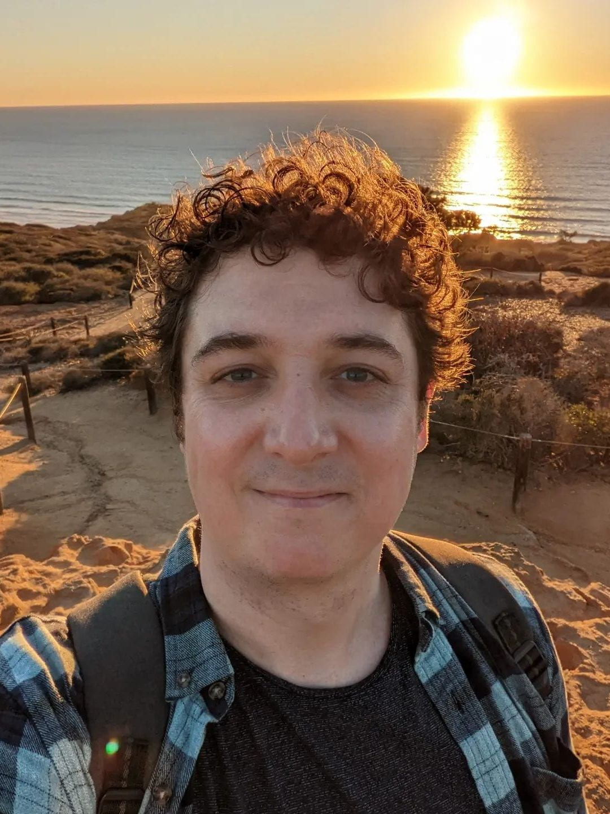
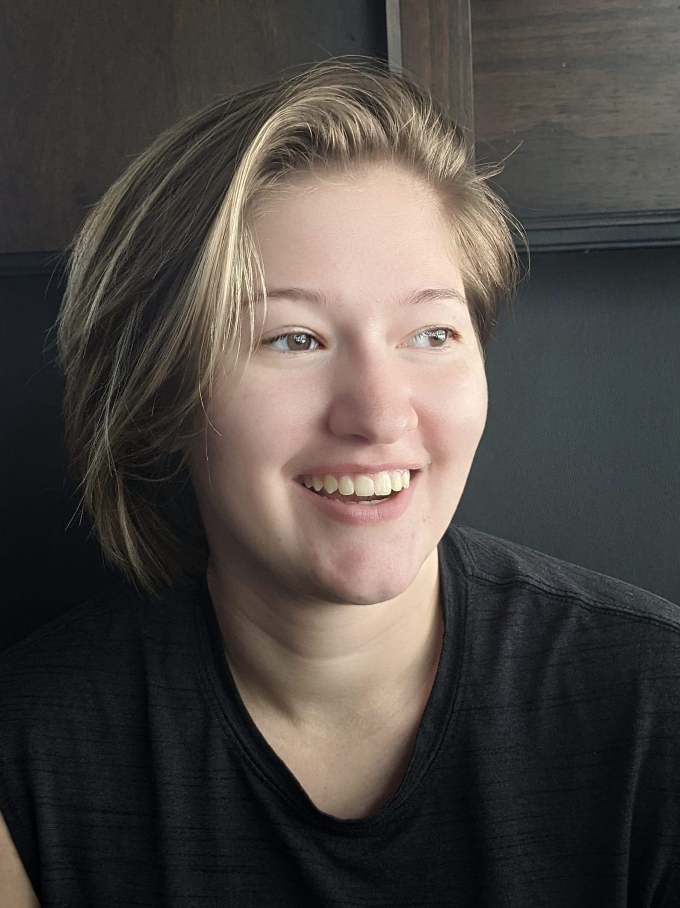
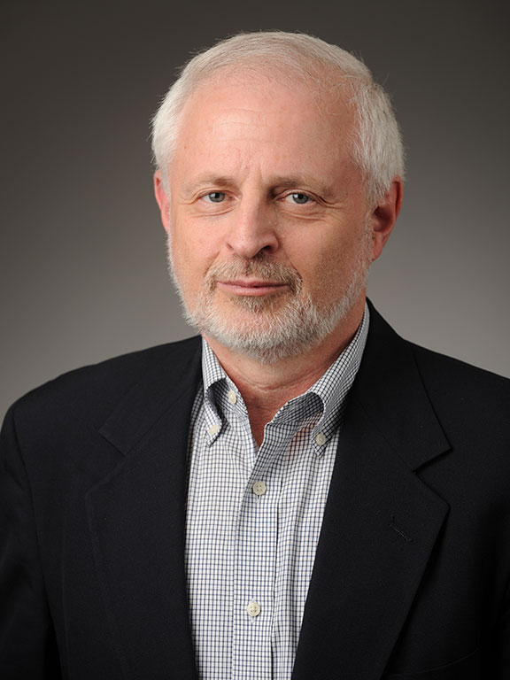
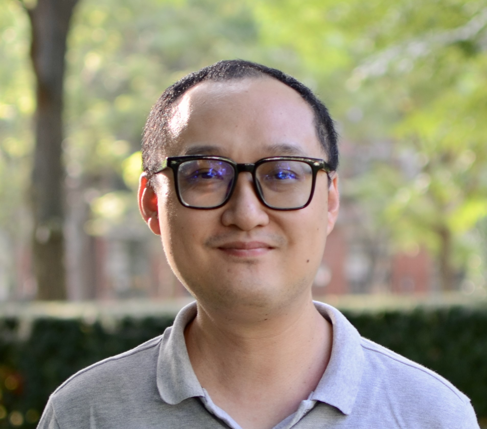
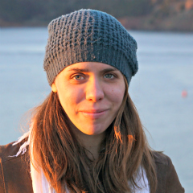
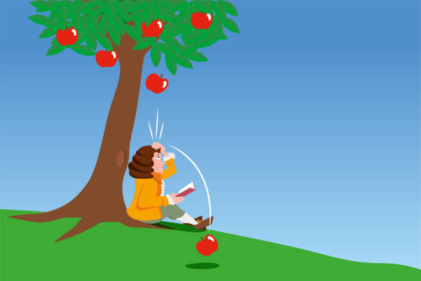
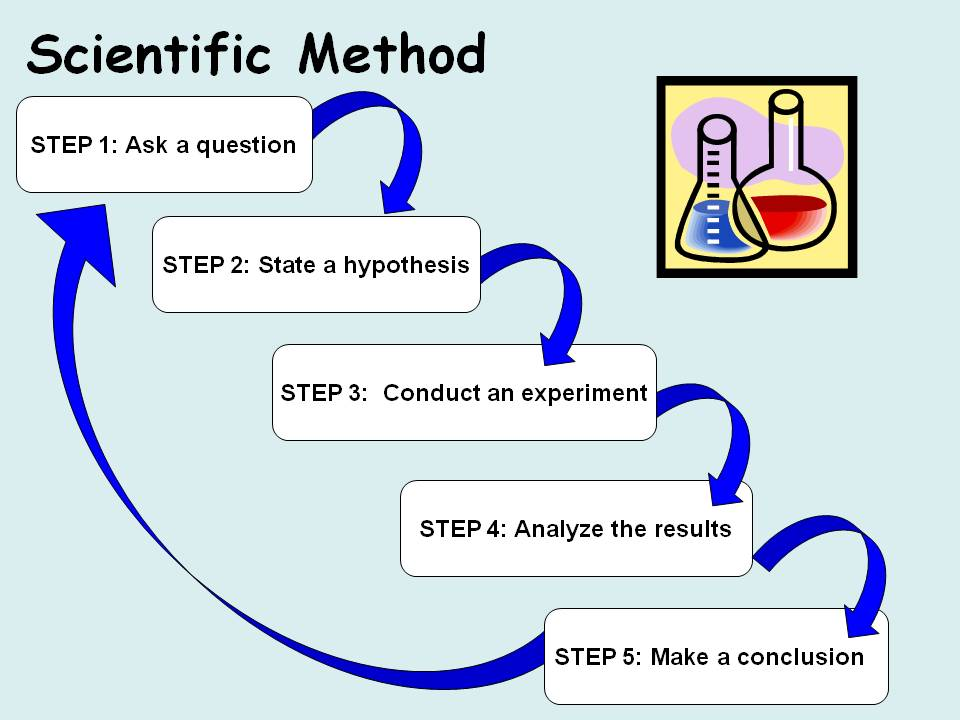
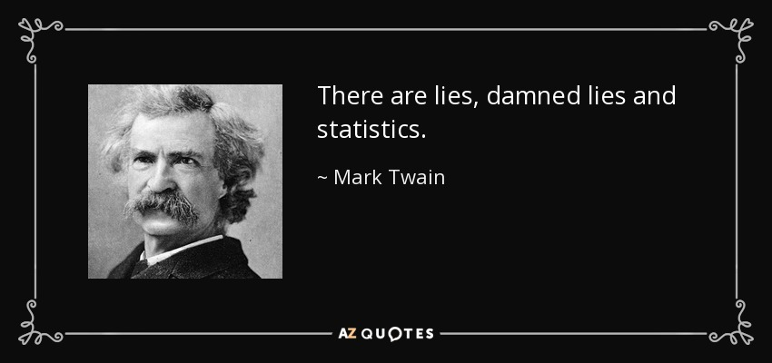

```{r}
#| echo: false


library(knitr)
library(formatR)
library(tidyverse)
opts_chunk$set(out.width = '100%', options(width=60))

opts_knit$set(global.par = TRUE)
opts_chunk$set(echo=FALSE, warning = FALSE, message = FALSE, comment = '', class.output='sh',
               fig.width=8, fig.height=5, fig.align = "center")

my_red <- "#E41A1C"
my_blue <- "#377EB8"
my_green <- "#4DAF4A"
my_purple <- "#984EA3"
my_orange <- "#FF7F00"
my_yellow <- "#FFFF33"
my_red2 <- "#FBB4AE" 
my_blue2 <- "#B3CDE3" 
my_green2 <- "#CCEBC5" 
my_purple2 <- "#DECBE4"
my_orange2 <- "#FED9A6"
my_yellow2 <- "#FFFFCC"

```


## Welcome!

Welcome to Statistical Analysis 1. We are your instructors


:::::: {style="font-size: 0.85em;"}
::::: {.columns .v-center-container}
::: {.column width="50%"}
{width="50%"}

**Mark Himmelstein**

Lab Instructor

PhD in Quantitative Psychology (2023)
:::

::: {.column width="50%"}
{width="50%"}

**Jess Helmer**

Lecture instructor

Third Year PhD student in Quantitative Psychology
:::
:::::
::::::


## Shoutouts

:::::: {style="font-size: 0.65em;"}
::::: {.columns .v-center-container}
::: {.column width="25%"}


**David Budescu**

My PhD advisor 

Now retired
:::

::: {.column width="25%"}


**Heining Cham**

Professor, Fordham University

Taught plurality of my stats courses
:::


::: {.column width="25%"}


**Leah Feuerstahler**

Associate Professor, Fordham University

Supervised much of my early teaching
:::

::: {.column width="25%"}


**Jim Roberts**

Former instructor of this course

Now retired
:::
:::::
::::::


## Lecture Structure

**Lecture:** 

Mondays and Wednesdays 3:30pm - 5:25pm, JS Coon 250

- Build statistical literacy
- Understand statistical theory

**Instructor:**

Mark Himmelstein

- **Warning:** I have a tendency to get excited about statistics. Don't be afraid to ask me to slow down!

**Office Hours:** Tuesdays 1:00pm - 2:00pm JS Coon 235

**Contact:** [mhimmelstein3@gatech.edu](mailto:mhimmelstein3@gatech.edu){style="color: #377EB8;"}

## Lab Structure

**Lab:** 

Fridays 2:000pm - 4:45pm, JS Coon 248

- Implement statistical analysis 
- Practice statistical computing in R
- Prepare reports in Quarto


**Instructor:**

Jess Helmer

**Office Hours:** Fridays 1-2pm JS Coon 241 or Zoom

**Contact:** [jhelmer3@gatech.edu](mailto:jhelmer3@gatech.edu){style="color: #377EB8;"}

## Big Picture

**This course will prepare you for:**

- Statistical Analysis II and future quantitative coursework

- Participation in research projects in academia or industry

- Critically evaluating research reported in both scientific journals and popular media

**Statistics is not a solved field!** 

- My goal is to make you both able and excited to develop it further yourself!

A lot of this will be familiar, but deeper, than prior undergraduate courses you have taken in statistics

## Course Objectives

**Throughout this course, we will learn how to**:

- Explore, describe, and visualize data

- Understand the relationship between probability and statistics

- How to use statistical analysis to facilitate inference and decision making

- Use computer simulation to help address complex problems

- Compare and contrast two competing perspectives on statistical inference:

  - Frequentist
  - Bayesian
  
  

## Final Grade Composition 

:::::: {style="font-size: 0.8em;"}

- **45%** Exams 
  - Three total, 15% each
  - Two midterms during class period (see schedule)
  - Final December 15th, 2:40pm
  - Non-cumulative
  - Open book (but no AI!)

- **30%** Homework Assignments 
  - 6 total
  - 5% each

- **14%** Lab Activities 
  - 14 total
  - Graded as complete/incomplete

- **10%** Ed Discussion and **1%** Ed Discussion Intro
  - more below
  
::::::

## Homework

There will be six (6) homework assignments

- Assigned on Fridays roughly every other week

- Will cover materials from the most recent four (4) classes

- Due second Thursday at 11:59pm ET after they are assigned

- Submit on Canvas using Quarto

  - You will learn to prepare reports in Quarto in lab

- Late submissions not accepted, except in extraordinary circumstances and with **prior arrangement** with the instructor

- You will receive feedback on your homework via Canvas


## Exams

:::::: {style="font-size: 0.925em;"}

- There are two midterms and one final exam which will be held in person. These are required for everyone

- Non-cumulative
    - Will only cover material covered since most recent exam

- Each exam will be proceeded by a review
    - Post timely review questions on Ed Discussion to ensure coverage!

- **Theoretical component:** Multiple choice and/or short answer questions about statistical theory (lecture material)
- **Applied component:** Conduct brief analysis on provided data or build a simple simulation (lecture + lab material)

- You may use any materials **except AI**!

- Makeup exams only available under in extraordinary circumstances and with **prior arrangement** with the instructor

::::::

## Lab Activities

- Each lab has an assignment that you should complete by the end of lab
  - Must be submitted by end of day on Friday to receive credit
- Graded as complete/incomplete
  - Meant to be low stakes practice!
- Lab will teach you how to apply concepts you learn in lecture using R
- You will also learn to use Quarto to prepare lab reports
- All lab activities and homeworks should be completed using Quarto
- See lab schedule on syllabus

## Ed Discussion

- Statistics friendly message forum 
- Easy to write code syntax and mathematical formulas
- Will be used in lieu of in-person participation grade
- Instructors will be on hand to respond
- For full credit, you must **average** one public post per week
  - Can be your own original question or comment, or an answer to another classmate's question or comment
  - Excludes Week 1, exam weeks, and Thanksgiving 
  - 12 total posts
- For specific questions about elements of graded material (homework, quizzes, your own grades, etc.) please post "To Instructors only"

## Ed Discussion Introduction

To get started the first week of class, write a brief introduction. Please include:

 - Name
 - Program of study
 - Lab, job, or other work you do that requires statistical analysis
 - Either:
    - At least one activity or hobby you enjoy
    - At least one local Atlanta restaurant recommendation
- 1% of grade just to do this!

## Extra Credit: Lab Project

Independent research project you can work on throughout the semester

- BYOD: Bring your own data
- Produce Quarto report with introduction, method, results, and discussion
- Results must include
  - Two inferential methods
    - One must be frequentist and one must be Bayesian 
      - Can be robustness check
    - Two data visualizations
- Ideally helps you develop your own research paper for publication

## Possible Data Sources

The project is best suited for students who have a dataset in hand already. But if you would like to complete the extra credit and don't already have data, here are some datasets you can consider:

- [Forecasting Proficiency Test (FPT) (my research!)](https://github.com/forecastingresearch/fpt)
- [National Center for Educational Statistics (NCES)](https://nces.ed.gov/)
- [U.S. Census Data](https://www.census.gov/programs-surveys/cps/data.html)
- [General Social Survey (GSS)](https://gss.norc.org/)
- [Midlife in the United States (MIDUS)](https://midus.wisc.edu/)
- [National Survey on Drug Use and Health (NSDUH)](https://www.samhsa.gov/data/data-we-collect/nsduh-national-survey-drug-use-and-health)

## Extra Credit: `posit::conf()`

[Posit](https://posit.co/) is the compay behind RStudio, the interactive development environment (IDE) we use to access `R`. They hold an annual [conference](https://conf.posit.co/2026/) from September 14-16. You can register for free to attend virtually. You can get up to one (1) point of extra credit on your homework by

- Attending the conference virtually
- Writing a brief report on what you learned during up to two (2) sessions
- Include these report with either Homework 1 or 2
- Each report will be worth 0.5 points for that homework

## Attendance

- You are expected to physically attend all lectures and labs
- If you need to miss for illness, family emergencies, etc. you should write the lab/lecture instructor in advance
- You are responsible for staying caught up on materials, assignments, and announcements, even in the event of absence
- Classes will have a Zoom option if you are unable to attend and recordings will be posted


## Software and Technology

In lab, you will learn to use `R`, a popular statistical software program.

- `R` will be required for lab assignments
- Can be accessed in lab, in most University computer labs, or downloaded to your personal computer.
- We will also learn how to do most calculations "by hand" 
  - On paper 
  - With a calculator 
  - Using `R` as a calculator)

## AI

Don't use AI to do your labs, homeworks, or quizzes:

- AI is getting better at giving right answers and matching styles
   - But we can tell when you (or AI) deviates from styles we teach in ways you cannot
- If you don't learn/practice the materials yourself, your exam grades may be negatively affected
- Academic integrity
- Learning to do this yourself is **really truly useful** and you should take it seriously

## Textbook Resources

There is no required textbook for this course. Instead, I have gathered together several different textbooks that are either open source or freely available to you from the Georgia Tech library

- Use these as a **supplement** to what we learn
- They are written using slightly different styles and notation
  - Both a feature and a bug! It's good to see how different people write about statistics and science
- Intended for students with different backgrounds and knowledge

I have provided **suggested** chapter readings that support the material covered in lecture. If you like learning from textbooks, I also suggest you sample each of them and decide if you want to go deeper than my suggested readings on one in particular

## Statistical Thinking for the 21st Century

Poldrack, R. A. (2019). Statistical Thinking for the 21st Century. [https://statsthinking21.github.io/statsthinking21-core-site/](https://statsthinking21.github.io/statsthinking21-core-site/) 

- More accessible/beginner friendly
- Takes a modern perspective (complementary)
- Doesn't go quite as deep as I'd like on it's own for a graduate level course


## Online Statistics Education

Lane, D.M. Online Statistics Education: A Multimedia Course of Study. [http://onlinestatbook.com/](http://onlinestatbook.com/) 

- Intermediate level
- Lots of nice details on probability that will prove helpful
- Not quite as modern as Poldrack (content or style)
- Still by no means dated

## [Learning statistical models through simulation in R: An interactive textbook]{style="font-size: 0.667em;"}

Barr, Dale J. (2021). Learning statistical models through simulation in R: An interactive textbook. Version 1.0.0. [https://psyteachr.github.io/stat-models-v1](https://psyteachr.github.io/stat-models-v1) 

- Intermediate to advanced
- Integrates R seamlessly
- Uses simulation framework I like
- More focus on topics you'll learn in Stat II and beyond than this class

## Learning Statistics with R

Navarro, D. Learning statistics with R. [https://learningstatisticswithr.com/](https://learningstatisticswithr.com/)

- Beginner to intermediate level
- Very focused on `R`
- Slightly out of date on the computational side (acknowledged by author)

## Answering Questions with Data

Crump, M. J. C., Navarro, D. J., & Suzuki, J. (2019). Answering Questions with Data: Introductory Statistics for Psychology Students. [https://www.crumplab.com/psyc3400/](https://www.crumplab.com/psyc3400/)

- Beginner to intermediate level
- Builds on Navarro's work
- More statistical, less computational
- Covers some key topics Poldrack and Lane do not

## Advanced Modeling and Data Challenges

Nguyen, M. (2025). Advanced modeling and data challenges (Vol. 3). Springer Cham. [https://link.springer.com/book/9783032017185](https://link.springer.com/book/9783032017185) OR partial Bookdown version at [https://mike-data-analysis.share.connect.posit.cloud/index.html](https://mike-data-analysis.share.connect.posit.cloud/index.html)

- Advanced level
- Technically volume three (of four)
- Provides detailed content on some advanced topics we will discuss
- Rest of book and other volumes provide much more detail on many topics, some we will cover some we will not
- Full PDF or ebook available through Georgia Tech library


## Slides, Questions, and Answers

I will post all of my slides on GitHub prior to class. **But these will not be the final versions of the slides**

- Some slide decks have questions I want you to answer or discuss 
- I use a spoiler mask to hide the answers 
- I will update the slides after class to include the version with the hidden content revealed

[You can't see this content (yet), but I can! The slides will be updated to include the version with this content after class]{.answer .fragment .content-visible unless-meta="params.v0"}


## Statistics (Singular)

:::::: {.fragment}

The study of statistics is all about developing a principled *language* to describe and interpret somewhat unpredictable (noisy) and somewhat predictable patterns.

In some types of science, there is a clear and direct relationship between different phenomena. Put another way: we can predict one event given knowledge of another event.

{width=40%}

::::::

## Statistics (Singular) con't

In others, there are *associations* and *differences* between phenomena that are not so clear and direct, but present nonetheless.

{width=50%}

Statistics are how we better understand those relationships.

## What Is Randomness?

:::::::: {style="font-size: 0.95em;"}

Is the outcome of a coin flip random? [Yes! At least at the limit of human knowledge and perception]{.answer .fragment .content-visible unless-meta="params.v0"}

Is the number of hours in a day random? [Not really. It's possible some cosmic event will change this, but we treat a day as a cycle of the earth around the sun that takes 24 hours]{.answer .fragment .content-visible unless-meta="params.v0"}

Is the amount time it takes for you to get from your home to campus random? [Sure is! It probably takes you roughly the same amount of time every day, but varies due to unpredictable conditions like traffic, weather, your mood, etc.]{.answer .fragment .content-visible unless-meta="params.v0"}

:::::: {.fragment}

**Random** $\neq$ **Arbitrary**

Anything that isn't perfectly predictable is subject to randomness, even things with some regularity. Statistics is all about separating the regularity from the randomness as best we can.

::::::
:::::::: 

## Science



## Chocolate Study 1


## Chocolate Study 2


## Chocolate Study 3


## Why Does Research Need **Good** Statisticians?

The chocolate study:

* Recruited real subjects
* Randomly assigned subjects to treatment groups
* Collected real data
* Statistically significant results
* Accepted for publication (within 24 hours) in a (supposedly) peer-reviewed journal

::: {.fragment style="text-align: center; font-size: 1.5em; font-weight: bold;"}
ARE YOU CONVINCED?!?
:::

## When Statisticians Go Bad

::: {style="text-align: center;"}
[The full story](https://io9.gizmodo.com/i-fooled-millions-into-thinking-chocolate-helps-weight-1707251800)
:::

* Fake author, fake institution
* Conducted by a journalist, not a dietitian
* Designed to grab headlines
  * More importantly: designed to show the pitfalls of misuse and misapplication of statistical methods

## Application and Consumption




::: {.fragment}


By the end of this course, you should be able to ask the right questions to understand both appropriate and inappropriate/misleading use of statistics.

::: 

## When do statistical methods fail?

::: {.fragment}
* Disconnect from theory
* Small sample sizes (5 men, 11 women)
* Not accounting for other important variables
* Collecting data on many variables, only reporting only a few results
* Over-reliance on **null hypothesis significance testing**
:::

## Statistics and Research Practice

Currently, many are concerned about the reliability of statistical results:

* My take: statistical training needs less focus on prescribed recipes and more focus on intuition, proper interpretation, and connections between method and insight

Null Hypothesis Significance Testing (NHST):

* Dominant in psychology and many other disciplines
* Certainly not the only method!

::: {style="text-align: center;"}
**We are in a time of transition**
:::

## Other Approaches

* NHST is only one way to do statistics
* Can be useful, but can also mislead
* We will cover NHST in this course, but as one tool in a researcher's toolkit
* Other important techniques we will go deeper in this course than many graduate level statistics courses in psychology have tended to over the last several decades:
  * Data visualization
  * Effect size
  * Uncertainty quantification
  * **Bayesian Methods**

## Basic Math

This course **is not** a math course, but it uses math. 

There will be a reasonable amount of math/algebra:

1. Order of Operations
2. Percents, Percentages, and Ratios
3. Complex sums and producs
4. Exponents, logarithms, roots, and inverses
5. Solving Symbolic Equations

## Advanced Math

It will also help to know the basics of

- Linear algebra
- Integral calculus

Neither of these are strictly necessary for this class, and to whatever extent they are, I will review the basics. These links can provide further review:

::: {style="font-size: 0.8em; text-align: center;"}
[Linear Algebra Review and Practice](https://bookdown.org/compfinezbook/introcompfinr/Matrix-Algebra-Review.html)

[Calculus 1 Review and Practice](https://tutorial.math.lamar.edu/Classes/CalcI/CalcI.aspx)
:::

Important to know, and a tool for understanding later concepts! But only as a tool so we can apply what we actually need to learn. We will emphasize **concepts** in addition to **computation**.


