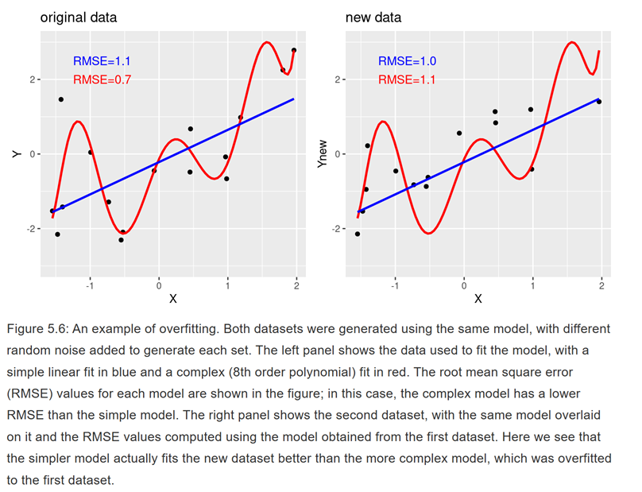

```{r}
#| echo: false


library(knitr)
library(formatR)
library(tidyverse)
opts_chunk$set(out.width = '100%', options(width=60))

opts_knit$set(global.par = TRUE)
opts_chunk$set(echo=FALSE, warning = FALSE, message = FALSE, comment = '', class.output='sh',
               fig.width=8, fig.height=5, fig.align = "center")

my_red <- "#E41A1C"
my_blue <- "#377EB8"
my_green <- "#4DAF4A"
my_purple <- "#984EA3"
my_orange <- "#FF7F00"
my_yellow <- "#FFFF33"
my_red2 <- "#FBB4AE" 
my_blue2 <- "#B3CDE3" 
my_green2 <- "#CCEBC5" 
my_purple2 <- "#DECBE4"
my_orange2 <- "#FED9A6"
my_yellow2 <- "#FFFFCC"

```

## Probability and Statistics

```{r}
#| fig.width: 6
#| fig.height: 2
#| out.width: "100%"

# Zero out standard plot margins
par(mar = c(0, 0, 0, 0))

# Initialize empty canvas
plot(0, 0, col = "white", xlim = c(0, 5), ylim = c(0, 3.5),
     bty = "n", xlab = "", ylab = "", xaxt = "n", yaxt = "n")

# --- Left Box (Population) ---
polygon(x = c(0.2, 1.7, 1.7, 0.2), y = c(2, 2, 3, 3), border = my_blue, lwd = 2)

# --- Right Box (Sample) ---
polygon(x = c(3.3, 4.8, 4.8, 3.3), y = c(.5, .5, 1.5, 1.5), border = my_purple, lwd = 2)

# --- Top Curve (Probability) ---
x_top <- seq(0.95, 4.05, length = 30)
y_top <- -0.478 * x_top^2 + 1.905 * x_top + 1.621
points(x_top, y_top, type = 'l', col = my_blue, lwd = 2)

# Top Arrow (pointing to Sample)
arrows(x0 = x_top[28], x1 = x_top[30], 
       y0 = y_top[28], y1 = y_top[30], 
       col = my_blue, lwd = 2)

# --- Bottom Curve (Statistics) ---
x_bot <- seq(0.95, 4.05, length = 30)
y_bot <- 0.435 * x_bot^2 - 2.656 * x_bot + 4.132
points(x_bot, y_bot, type = 'l', col = my_purple, lwd = 2)

# Bottom Arrow (pointing to Population)
arrows(x0 = x_bot[3], x1 = x_bot[1], 
       y0 = y_bot[3], y1 = y_bot[1], 
       col = my_purple, lwd = 2)

# --- Text Labels ---
text(x = 0.95, y = 2.65, "Population", col = my_blue)
text(x = 0.95, y = 2.35, "(Parameter)", col = my_blue)

text(x = 4.05, y = 1.15, "Sample", col = my_purple)
text(x = 4.05, y = 0.85, "(Data)", col = my_purple)

text(x = 3.1, y = 3.3, "Probability", col = my_blue)
text(x = 1.9, y = 0.3, "Statistics", col = my_purple)
```

:::: {style="font-size: 0.8em;"}
::: {style="margin-top: -10px;"}
Most of what we have done so far has been developing a conceptual understanding about the relationship between probability and statistics

-   The rules of probability govern how data are generated
-   Statistics summarize samples of data
-   Sampling distributions govern how we expect statistics to be distributed in (hypothetical) repeated samples
-   Allows us to make practical inferences about the plausibility of observed statistics based on assumptions (null hypotheses) about a population
:::
::::

## Models

Models are simplified representations of complex objects

::::: {.columns .v-center-container}
::: {.column width="50%"}

:::

::: {.column width="50%"}

:::
:::::

## Statistical Model

A statistical model is a simplified representation of a data generating process (DGP)

- DGPs are **probabilistic** in nature

Statistical models in their simplest form have the structure

$$\text{data} = \text{model} + \text{error}$$

- **Model:** Way to represent predictable part of data
- **Error:** Leftover unpredictable part of data
-   **Goal:** Minimize error (maximize predictability of data via model)
    -   Sometimes called a *loss function*
    -   How much information is lost between $\text{model}$ and $\text{data}$

## Model Usage

There are three common uses of statistical models

1.  **Describe:** A statistical model can help us understand data by summarizing variables or mapping relationships between different variables

2.  **Predict:** A statistical model can help us anticipate how we expect **new** observations, which were not in our initial sample that we used to estimate the model, to look

3.  **Decide:** A statistical model can guide how we choose to behave by helping us understand the likelihood of different consequences of our choices 

Though each of these use cases is slightly distinct, they are highly overlapping, and philosophy of science openly debates their relative importance.

## Describing Data

We've already discussed ways to describe data quite a bit. For a continuous variable, what is **one single number** that we might use to best describe the variable, if we had to choose

[**The sample mean**]{.fragment}

-   [The sum of all errors around the mean is always **zero**]{.fragment}
    -   [Because of this, summing errors isn't very helpful]{.fragment}
    -   [We know the total amount of error isn't zero!]{.fragment}
    -   [What else might we use for our loss function?]{.fragment}

## Loss Function: Squared Error

The most common **loss function** in statistics is minimization of **squared error**

-   Minimized by the **mean**

We might minimize the *sum* of squared errors

$$\text{Sum of Squared Errors (SSE)} = \sum (x - \bar{x})^2$$

## A Familiar Form

::: {style="font-size: 0.85em;"}


Where have we seen this term before though?

[$$s^2 = \frac{\sum (x - \bar{x})^2}{N - 1}$$]{.fragment}

Another term for variance: **Mean squared error (MSE)**

-   SSE is sensitive to sample size: larger $N \rightarrow$ larger sum of squared errors
-   MSE is insensitive to sample size
    -   For estimating **population** variance from **sample** variance, we divide by $N - 1$ in calculating MSE. But for other purposes, it doesn't matter which we use
    - $N$ or $N - 1$ is just a constant to scale for sample size. 
-   Root mean squared error (RMSE) $=\sqrt{MSE}$
    -   Like $SD$, in original units (not squared units)
    -   Comparing RMSE of different models is a common way of evaluating their performance

:::

## Proof {.scrollable}

I want to minimize my function

$$f(a) = \sum_{i = 1}^n (x_i - a)^2$$

1.  Expand:

$$\sum_{i = 1}^n(x_i - a)^2 = \sum_{i = 1}^n(x_i - a)(x_i - a) = \\ \sum_{i = 1}^n x_i^2 - 2a \sum_{i = 1}^n x_i + na^2$$

2.  Take derivative with respect to $a$:

$$\frac{d}{da} f(a) = -2 \sum_{i = 1}^n x_i + 2na$$

3.  Solve for the zero point:

$$0 = -2 \sum_{i = 1}^n x_i + 2na$$

$$2na = 2 \sum_{i = 1}^n x_i$$

$$a = \frac{1}{n} \sum_{i = 1}^n x_i = \frac{\sum_{i = 1}^n x}{n} = \bar{x}$$

## Loss Function: Absolute Error

In some uses cases, you will see *absolute* error used over *squared* error

-   Less sensitive to extreme values
-   Lacks some desirable statistical properties
    -   E.g. additivity of variances (Pythagorean Rule of Statistics)

$$\text{Mean Absolute Error (MAE)} = \frac{\sum |x - \bar{x}|}{N}$$

-   Minimized by **median**

## Mean as Model

We can use the mean to represent a statistical model of the form

$$\text{data} = \text{model} + \text{error}$$

as:

$$x_i = \mu + \epsilon_i$$

-   **Note:** the model uses $\mu$, the parameter, which we can estimate with $\bar{x}$, the statistic
-   $\epsilon_i$ is known as the **residual** or **error**
-   $\epsilon$ has a mean of 0 and standard deviation of $\sigma$

## Model Predictions

Another way to write this model is in terms of **predictions**.

$$\hat{x}_i = \mu$$

-   $\hat{x}_i$ is the **predicted value** of $x_i$

Combining the two formulations, we can also say

$$\epsilon_i = x - \hat{x}_i$$

$$SSE = \sum (x - \hat{x}_i)^2$$

$$MSE = \frac{\sum (x - \hat{x}_i)^2}{N}$$

## McCrea Revisited

**Original Study**:

::: {style="font-size: 0.6em;"}
McCrea, S. M. (2008). Self-handicapping, excuse making, and counterfactual thinking: Consequences for self-esteem and future motivation. *Journal of Personality and Social Psychology*, *2*, 274-292.
:::

::: {style="font-size: 0.95em;"}
**Replication study link**: <https://osf.io/2kjgz>

**Step 1**: Subject took a math exam and were told that they scored in the 35th percentile of university students

**Step 2**: Subjects saw statements supposedly written by previous participants

-   Self-handicap group: half of statements indicated that more practice would have improved their performance, half of statements were neutral

-   Control group: all statements were neutral

**Step 3**: Subjects took a second surprise math exam
:::

```{r}
dat <- read.csv("../../data/McCrea.csv") |> 
  mutate(Cond = recode(as_factor(Cond), 
                       "1" = "self-handicap", 
                       "2" = "control"))

dat$Cond <- factor(dat$Cond, levels = c("control","self-handicap"))
```

## Is The Mean Enough?

In the McCrea data, all participants took a math test after being assigned to either control or self-handicap.

Should we

-   Use the **overall** mean to summarize these math scores?
-   Should we use separate means for each group?
-   How should we decide?
-   How should we write our model?

## Modeling Separate Means

How can I represent both group means in a single equation?

::: fragment
Let's start by defining the control group as

$$\text{percent}_i = \beta_0 + \epsilon_i$$

Where $\beta_0$ is the mean in the control group. How can I incorporate the self-handicap group?
:::

::: fragment
**Reminder:** We can represent group assignment with the `Cond` variable, where 0 = control and 1 = self-handicap
:::

::: fragment
What do you suppose $\beta_1$ would represent in this equation?

$$\text{percent}_i = \beta_0 + \beta_1 \text{Cond} + \epsilon_i$$
:::

[$\beta_1 = \text{mean of self-handicap} - \beta_0$]{.answer .fragment .content-visible unless-meta="params.v0"}

## Linear Model Form

You might notice that this model has a familiar form

- **Linear equation:** $y = mx + b$
- **Linear model equation:** $y_i = \beta_0 + \beta_1 x + \epsilon_i$

Where the "linear" component of the model is:

- $\beta_0$ = intercept
- $\beta_1$ = slope

And then there is also 

- $\epsilon_i$: residual error
    - How $y_i$ deviates from predictions
    

## Linear Predictions (One Mean)

If we just use the **overall** mean

```{r}
#| echo: true
mean(dat$percent)
```

How does this map onto our linear equation?

::::: { .content-visible unless-meta="params.v0"}
:::: { .fragment}
::: {.answer}
The groups have the same mean under this model, so we have:

- $\beta_0 = 0.522$
- $\beta_1 = 0$

$\text{percent}_i = 0.522 + 0(\text{Cond}) + \epsilon_i$

:::
::::
:::::

## Base Plot

```{r}
#| echo: false

# Base plot with specified axis limits
p_base <- ggplot() +
  scale_x_continuous(
    limits = c(-0.2, 1.2), 
    breaks = c(0, 1), 
    labels = c("Control (0)", "Self-handicap (1)")
  ) +
  scale_y_continuous(limits = c(0, 1)) +
  labs(
    x = "Condition (Cond)",
    y = "Math Score (prop. correct)",
  ) +
  theme_minimal(base_size = 16) +
  theme(
    panel.grid.minor = element_blank(),
    axis.title = element_text(face = "bold"),
    plot.title = element_text(face = "bold", hjust = 0.5)
  )

p_base
```

## Adding Control

```{r}

#| echo: false


# Add point and annotation for the Intercept at (0, 0.522)
p_intercept <- p_base +
  annotate("point", x = 0, y = 0.522, color = my_blue, size = 4.5) +
  annotate(
    "text", x = -.19, y = 0.56, 
    label = "Overall mean = 0.522", 
    color = my_blue, fontface = "bold", size = 5,
    hjust = -0.08, vjust = -0.5
  )

p_intercept
```


## Adding Self-Handicap

```{r}
#| echo: false


# Add point at (1, 0.522), flat line, and slope = 0 annotation
p_slope <- p_intercept +
  annotate("point", x = 1, y = 0.522, color = my_blue, size = 4.5) +
  annotate(
    "text", x = 1.19, y = 0.4, 
    label = "Overall mean = 0.522", 
    color = my_blue, fontface = "bold", size = 5,
    hjust = 1.05, vjust = -0.5
  ) 

p_slope
```

## Adding Slope

```{r}
#| echo: false


# Add point at (1, 0.522), flat line, and slope = 0 annotation
p_slope <- p_intercept +
  annotate("point", x = 1, y = 0.522, color = my_blue, size = 4.5) +
  annotate(
    "text", x = 1.19, y = 0.4, 
    label = "Overall mean = 0.522", 
    color = my_blue, fontface = "bold", size = 5,
    hjust = 1.05, vjust = -0.5
  ) +
  # Flat line representing slope = 0
  geom_segment(
    aes(x = 0, y = 0.522, xend = 1, yend = 0.522), 
    color = "gray30", linewidth = 1, linetype = "dashed"
  ) +
  # Slope text label and arrow pointer
  annotate(
    "text", x = 0.5, y = 0.65, 
    label = "slope = 0", 
    color = "gray20", fontface = "bold.italic", size = 5
  ) +
  annotate(
    "curve", x = 0.5, y = 0.625, xend = 0.5, yend = 0.527,
    curvature = -0.2, arrow = arrow(length = unit(0.25, "cm")), 
    color = "gray30", linewidth = 0.8
  )

p_slope
```

## Linear Predictions (Group Means)

If we use the **group** means

```{r}
#| echo: true
dat |> group_by(Cond) |> summarize(mean = mean(percent))
```

How does this map onto our linear equation?

::::: { .content-visible unless-meta="params.v0"}
:::: { .fragment}
::: {.answer}
The groups have the same mean under this model, so we have:

- $\beta_0 = 0.583$
- $\beta_1 = 0.466 - 0.583 = -0.117$

$\text{percent}_i = 0.583 - 0.117(\text{Cond}) + \epsilon_i$

:::
::::
:::::

## Base Plot

```{r}
#| echo: false


# Base plot with specified axis limits
p_base <- ggplot() +
  scale_x_continuous(
    limits = c(-0.2, 1.2), 
    breaks = c(0, 1), 
    labels = c("Control (0)", "Self-handicap (1)")
  ) +
  scale_y_continuous(limits = c(0, 1)) +
  labs(
    x = "Condition (Cond)",
    y = "Math Score (prop. correct)",
  ) +
  theme_minimal(base_size = 16) +
  theme(
    panel.grid.minor = element_blank(),
    axis.title = element_text(face = "bold"),
    plot.title = element_text(face = "bold", hjust = 0.5)
  )

p_base

```


## Adding Control

```{r}

#| echo: false


# Add point and annotation for the Intercept at (0, 0.522)
p_intercept <- p_base +
  annotate("point", x = 0, y =  0.583, color = my_blue, size = 4.5) +
  annotate(
    "text", x = -.19, y =  0.6, 
    label = "control mean =  0.583", 
    color = my_blue, fontface = "bold", size = 5,
    hjust = -0.08, vjust = -0.5
  )

p_intercept
```


## Adding Self-Handicap

```{r}
#| echo: false


# Add point at (1, 0.522), flat line, and slope = 0 annotation
p_slope <- p_intercept +
  annotate("point", x = 1, y = 0.466, color = my_blue, size = 4.5) +
  annotate(
    "text", x = 1.19, y = 0.375, 
    label = "self-handicap mean = 0.466", 
    color = my_blue, fontface = "bold", size = 5,
    hjust = 1.05, vjust = -0.5
  ) 

p_slope
```

## Adding Slope

```{r}
#| echo: false


# Add point at (1, 0.522), flat line, and slope = 0 annotation
p_slope <- p_intercept +
  annotate("point", x = 1, y = 0.466, color = my_blue, size = 4.5) +
  annotate(
    "text", x = 1.19, y = 0.375, 
    label = "self-handicap mean = 0.466", 
    color = my_blue, fontface = "bold", size = 5,
    hjust = 1.05, vjust = -0.5
  )  +
  # Flat line representing slope = 0
  geom_segment(
    aes(x = 0, y = 0.583, xend = 1, yend = 0.466), 
    color = "gray30", linewidth = 1, linetype = "dashed"
  ) +
  # Slope text label and arrow pointer
  annotate(
    "text", x = 0.55, y = 0.65, 
    label = "slope = -0.117", 
    color = "gray20", fontface = "bold.italic", size = 5
  ) +
  annotate(
    "curve", x = 0.5, y = 0.625, xend = 0.5, yend = 0.527,
    curvature = -0.2, arrow = arrow(length = unit(0.25, "cm")), 
    color = "gray30", linewidth = 0.8
  )

p_slope
```


## The General Linear Model

On of the most common forms a statistical model can take is called the **general linear model**, which has the form

$$y_i = \beta_0 + \sum_{p=1}^P \beta_p x_{ip} + \epsilon_i$$

Where $P$ is the number of *predictor variables* in our model.

- $\beta_0$ is the intercept
- $\beta_p$ is/are slope(s)
    - More on how we deal with slopes (plural) later!
- $\epsilon_i$ is residual error

## Variable Types

-   **Predictor variables** are sometimes referred to as **independent variables**
    -   In our example `Cond` can be thought of as a predictor variable and $P = 1$ (just one predictor)
-   We can refer to $y$ in this model as our **outcome** or **dependent** variable
    -   Math scores are the outcome variable in our example
-   Some debate around the appropriate semantics, but terms are interchangeable in many settings
    - **Independent** = **Predictor** variables
    - **Dependent** = **Outcome** variables

The parameters of a general linear model are $\beta_0 \dots \beta_P$ AND $\sigma^2_{\epsilon}$ (variance of the residuals, aka pooled variance)

## With Shared $\sigma$


```{r}
library(ggplot2)

# --- 1. Generate data for vertical normal distributions ---
sigma <- 0.197
scale_fact <- 0.05  # Controls width of distribution on x-axis

y_grid <- seq(-1,2, length.out = 200)

# Control group distribution (mean = 0.583 at x = 0)
poly_0 <- data.frame(
  x = c(0, 0 + dnorm(y_grid, mean = 0.583, sd = sigma) * scale_fact, 0),
  y = c(min(y_grid), y_grid, max(y_grid))
)

# Self-handicap group distribution (mean = 0.466 at x = 1)
poly_1 <- data.frame(
  x = c(1, 1 + dnorm(y_grid, mean = 0.466, sd = sigma) * scale_fact, 1),
  y = c(min(y_grid), y_grid, max(y_grid))
)

# --- 2. Build plot ---
ggplot() +
  # Vertical Normal Distributions
  geom_polygon(data = poly_0, aes(x = x, y = y), fill = my_blue, alpha = 0.2) +
  geom_path(data = poly_0, aes(x = x, y = y), color = my_blue, linewidth = 0.8) +
  geom_polygon(data = poly_1, aes(x = x, y = y), fill = my_blue, alpha = 0.2) +
  geom_path(data = poly_1, aes(x = x, y = y), color = my_blue, linewidth = 0.8) +
  
  # Scales & Labels
  scale_x_continuous(
    limits = c(-0.2, 1.2), 
    breaks = c(0, 1), 
    labels = c("Control (0)", "Self-handicap (1)")
  ) +
  scale_y_continuous(limits = c(0, 1)) +
  labs(
    x = "Condition (Cond)",
    y = "Math Score (prop. correct)"
  ) +
  theme_minimal(base_size = 16) +
  theme(
    panel.grid.minor = element_blank(),
    axis.title = element_text(face = "bold"),
    plot.title = element_text(face = "bold", hjust = 0.5)
  ) +
  
  # Mean Points & Text Labels
  annotate("point", x = 0, y = 0.583, color = my_blue, size = 4.5) +
 annotate(
    "text", x = -.19, y =  0.6, 
    label = "control mean =  0.583", 
    color = my_blue, fontface = "bold", size = 5,
    hjust = -0.08, vjust = -0.5
  ) + 
  annotate("point", x = 1, y = 0.466, color = my_blue, size = 4.5) +
   annotate(
    "text", x = 1.19, y = 0.375, 
    label = "self-handicap mean = 0.466", 
    color = my_blue, fontface = "bold", size = 5,
    hjust = 1.05, vjust = -0.5
  )  +
  
  # Flat line representing slope
  geom_segment(
    aes(x = 0, y = 0.583, xend = 1, yend = 0.466), 
    color = "gray30", linewidth = 1, linetype = "dashed"
  ) +
  
  # Slope annotation
 annotate(
    "text", x = 0.55, y = 0.65, 
    label = "slope = -0.117", 
    color = "gray20", fontface = "bold.italic", size = 5
  )  +
  annotate(
    "curve", x = 0.5, y = 0.625, xend = 0.5, yend = 0.527,
    curvature = -0.2, arrow = arrow(length = unit(0.25, "cm")), 
    color = "gray30", linewidth = 0.8
  )+
  
  # Shared Sigma Annotation & Arrows
  annotate(
    "text", x = 0.5, y = 0.30, 
    label = "sigma == 0.197", parse = TRUE,
    color = "gray20", fontface = "bold", size = 5
  ) +
  annotate(
    "curve", x = 0.40, y = 0.30, xend = 0.08, yend = 0.35,
    curvature = 0.15, arrow = arrow(length = unit(0.25, "cm")),
    color = "gray30", linewidth = 0.8
  ) +
  annotate(
    "curve", x = 0.60, y = 0.30, xend = 1.08, yend = 0.35,
    curvature = -0.15, arrow = arrow(length = unit(0.25, "cm")),
    color = "gray30", linewidth = 0.8
  )
```

## Linear Algebra Form

Or we can use linear algebra to write our model more compactly as

$$\boldsymbol{y} = \boldsymbol{X\beta} + \boldsymbol{\epsilon}$$

Where

-   $\boldsymbol{y}$ is a vector of length $N$ representing our outcome variable
-   $\boldsymbol{X}$ is an $N \times P + 1$ matrix of predictors
    -   The first column is just a column of ones (to account for the intercept)
-   $\boldsymbol{\beta}$ is a vector of length $P + 1$ of coefficients, including intercept
-   $\boldsymbol{\epsilon}$ is a vector of length $N$ of residuals

## Original $t$-test

```{r}
#| echo: true
t.test(percent ~ Cond, dat, var.equal = TRUE)
```

This was the $t$-test we saw previously (without the Welch-Satterthwaite adjustment)

## Linear Model

::: {style="font-size: 0.9em;"}

We can write a general linear model in `R` using the `lm()` function and formula syntax and examine the output with `summary()`. The `Coefficients` table will show us information about $\beta_0$ and $\beta_1$. Let's compare the output to the $t$-test we have already seen

```{r}
#| echo: true
lm1 <- lm(percent ~ Cond, dat)
summary(lm1)

```

:::

## Similarities

-   [$\beta_0 = \text{mean in group control} = 0.583$]{.answer .fragment .content-visible unless-meta="params.v0"}
-   [$\beta_0 + \beta_1 = \text{mean in group self-handicap} = 0.583 - 0.117 = 0.466$]{.answer .fragment .content-visible unless-meta="params.v0"}
-   [$t_{\bar{x}_1 - \bar{x}_2} = t_{\beta_1} = -2.325$]{.answer .fragment .content-visible unless-meta="params.v0"}
-   [$df_{\text{t-test}} = df_{\text{model}} = N - 2 = 59$]{.answer .fragment .content-visible unless-meta="params.v0"}

## Prediction

We've just seen how our general linear model with `Cond` as a lone predictor **describes** our data in terms of each group mean, and that we can perform a null hypothesis test that is equivalent to a $t$-test.

Now let's think about **prediction**

We have estimated the following model

$$\text{percent}_i = 0.583 - .117(\text{Cond}) + \epsilon_i$$

Or

$$\hat{\text{percent}} = 0.583 - .117(\text{Cond})$$

We will start with the predicted values from our dataset

## Predicted Values

I can manually recode `Cond` to the numeric values that match what I want.

I can then plug in for $\beta_0$, $\beta_1$, and $x$ (cond) to make predictions about $y$ (percent)

```{r}
#| echo: true
dat$Cond_numeric <- ifelse(dat$Cond == "control", 0, 1)
(y_hat <- 0.583 - .117 * dat$Cond_numeric)
```

## Auto-predicted Values

Or I can used the `predict()` function to do it for me

```{r}
#| echo: true
(y_hat <- predict(lm1))
```

## MSE and RMSE

$$\text{mean squared error (MSE)} = \frac{\sum (y - \hat{y}_i)^2}{N}$$

$$\text{root mean squared error (RMSE)} = \sqrt{MSE}$$

```{r}
#| echo: true
(mse_full <- mean((y_hat - dat$percent)^2))

(rmse_full <- sqrt(mse_full))
```

What can we do with these?

## Model Comparison

One thing we might consider is whether this model, which assumes each group has a separate mean, makes better predictions than a simpler model

-   **Better predictions** $\rightarrow$ **less error**
-   **Simpler model** $\rightarrow$ **fewer parameters**

What's a model we might consider that has fewer parameters?

-   [A model that sets $\beta_1 = 0$, meaning both groups share the **same mean**]{.answer .fragment .content-visible unless-meta="params.v0"}

## Simpler Model

We already saw an example of the "mean as model" earlier, sometimes called an "unconditional model" or "intercept only" model.

In our running example, we would write it as

$$\text{percent}_i = \beta_0 + \epsilon_i$$


**Alternatively:** We are implicitly fixing $\beta_1 = 0$ and estimating $\beta_0$

$$\text{percent}_i = \beta_0 + 0(\text{Cond}) + \epsilon_i$$

-   In this model, $\beta_0 = \mu$, which we estimate with $\bar{x}$


In `R` we write an unconditional model by putting a `1` on the right hand side of our formula

## Unconditional model

```{r}
#| echo: true
lm_unconditional <- lm(percent ~ 1, dat)
summary(lm_unconditional)

```

## Predicted Values

```{r}
#| echo: true
(y_hat_unconditional <- predict(lm_unconditional))
```

**Notice:** Every single value is predicted to be $\bar{x}$!

## MSE and RMSE

```{r}
#| echo: true
(mse_unconditional <- mean((y_hat_unconditional - dat$percent)^2))
(rmse_unconditional <- sqrt(mse_unconditional))
```

Compared to our original "full" model (separate group means), these values are higher, meaning there is **more error**

```{r}
#| echo: true
mse_full
rmse_full
```

So the full model is better, right?

## Overfit

In this example, we used the same data to **fit** or **estimate** the model as well we did to make predictions and evaluate error.

-   Any time you add a predictor to a linear model you estimate with a sample of data, you will reduce error in the predictions within the same sample
-   This is known as "overfit"
-   Bias in which a model captures random variation and treats it as informative signal
-   In prediction, what we really care about is how well the model will predict (generalize to) **new data**

## Overfit Visualized



## New Data

If we want to validate our model on new data, instead of the same data we used to estimate it, how might we go about this?

-   [Go collect more data (expensive)]{.fragment}
-   [Split our data into pieces (cheap)]{.fragment}
    -   [This is known as **cross-validation**]{.fragment}
        -   [**Benefit:** allows us to test how well model generalizes]{.fragment}
        -   [**Cost:** reduces our sample size so we can hold out some data for validation]{.fragment}

## Procedure

1.  Specify a **training** dataset

    -   Used to estimate model(s)

2.  Specify a **testing** data

    -   Used to validate model(s)

3.  Estimate model on training data
4.  Make predictions about testing data using model(s) estimated on training data
5.  Calculate MSE/RMSE 
      - **From model** estimated on training data
      - **In predictions** about testing data
6.  Select model with lowest MSE/RMSE

## Example: Step 1 and 2

Our data groups subjects by IDs indicated by the variable `Subject`

I'm going to use the `sample()` function to select half of the subjects and put them in a training set, and leave the rest for a testing set.

```{r}
dat <- dat |> 
  mutate(Subject = 1:n())

```

```{r}
#| echo: true
subject_ids <- dat$Subject

set.seed(124)

half_ids <- sample(subject_ids, size = length(subject_ids)/2)

training_data <- dat |> filter(Subject %in% half_ids) # Training data
testing_data <- dat |> filter(!(Subject %in% half_ids)) # Testing data

```


The code `filter(Subject %in% half_ids)` is saying only keep the subjects sampled in `half_ids`, and the `!` symbol is saying keep all the subjects NOT sampled in `half_ids`


## Training data

```{r}
#| echo: true

training_data
```

## Testing data

```{r}
#| echo: true

testing_data
```

## Example: Step 3-6

::: {style="font-size: 0.9em;"}

Next I will estimate my "full" model that separates participants by `Cond` and my "reduced" (unconditional) model on the training data

```{r}
#| echo: true
lm_full <- lm(percent ~ Cond, training_data)
lm_reduced <- lm(percent ~ 1, training_data)
```

The make predictions in my new dataset using the `newdata = testing_data` argument of the `predict()` function

```{r}
#| echo: true
predict_full <- predict(lm_full, newdata = testing_data)
predict_reduced <- predict(lm_reduced, newdata = testing_data)
```

Then calculate RMSE in both cases

```{r}
#| echo: true
sqrt(mean((predict_full - testing_data$percent)^2))
sqrt(mean((predict_reduced - testing_data$percent)^2))

```

The reduced model made **Very slightly** better predictions (lower error), which might be evidence against treating the groups as having meaningfully different means, but the difference here is negligible. 

:::

## Reverse

We can also reverse the process, and swap which dataset we use for training and which we use for testing for a full two-way cross validation

```{r}
#| echo: true
lm_full <- lm(percent ~ Cond, testing_data)
lm_reduced <- lm(percent ~ 1, testing_data)

predict_full <- predict(lm_full, newdata = training_data)
predict_reduced <- predict(lm_reduced, newdata = training_data)

sqrt(mean((predict_full - training_data$percent)^2))
sqrt(mean((predict_reduced - training_data$percent)^2))
```

In this case, the full model made better predictions (lower error)

- Suggests that the full model is making better predictions
- Part of the issue here is that the total sample is so small that there's a big cost to splitting it in half

## Alternative Procedures

::: {style="font-size: 0.77em;"}

Splitting the data in half is costly because of how much your sample size is reduced. Other options that keep the dataset (more) intact are

-   $k$-fold cross validation
    -   Split the data into $k$ different "folds" or subsets of equal size
    -   For each fold, train the model on the remaining $k - 1$ folds, then test it on the held out $k$th fold
    -   Repeat for each fold
    -   Calculate the average RMSE across folds
-   Leave one out (LOO) cross validation:
    -   For each of the $N$ datapoints in a dataset:
        -   Train model on the remaining $N - 1$ datapoints
        -   Make prediction about the single held out datapoint
        -   Calculate average RMSE for each held out datapoint 
        - Can get computationally expensive (slow)
          - Sometimes there are ways to approximate LOO methods

::: 

## Decide

So far we have discussed using statistical models to:

-   Describe existing samples of data
-   Make predictions about new data

But how does this help us? What do we do with this information?

[Should we encourage or discourage self-handicapping based on the results of McCrea's study?]{.answer .fragment .content-visible unless-meta="params.v0"}

## Fisher vs. Neyman

:::::: {style="font-size: 0.65em;"}
::::: {.columns .v-center-container}
::: {.column width="50%"}
{width="70%"}

Ronald Fisher (1890-1962)
:::

::: {.column width="50%"}
{width="60%"}

Jerzy Neyman (1895-1980)
:::
:::::
::::::

## Inference vs. Behavior

::::: {.columns .v-center-container}
::: {.column width="40%"}
**Fisher:**

-   We build statistical models to test theories about the world
-   Meant for learning (describing)
-   Science is about **inference**
:::

::: {.column width="60%"}
**Neyman:**

-   We do inference to decide how to behave
-   **Inductive Behavior:** Based on what I learned from data, should I behave as if self-handicapping is harmful or not?
-   Should I consider interventions to prevent self-handicapping, or allow people to self handicap?
    -   I can't know for sure, but experiments and models help minimize the errors I make (costs I incur) across many decisions I might make
    
:::
:::::

## Statistical Decision Theory

-   Subfield of statistics focused on how to make choices based on what we learn from statistical models
-   Interdisciplinary:
    -   Probability and statistics
    -   Economics
    -   Psychology
    -   Policy and political science
    -   Business and operations
-   Covered in *The Science of Decision Making* (Offered Spring '27)


## Last Chance for Review!

Our next class will be our review session

- If you want to see any material reviewed, post on Ed Discussion ASAP
- All material covered through today is fair game for exam
- Exam will be next Thursday at regular class time
