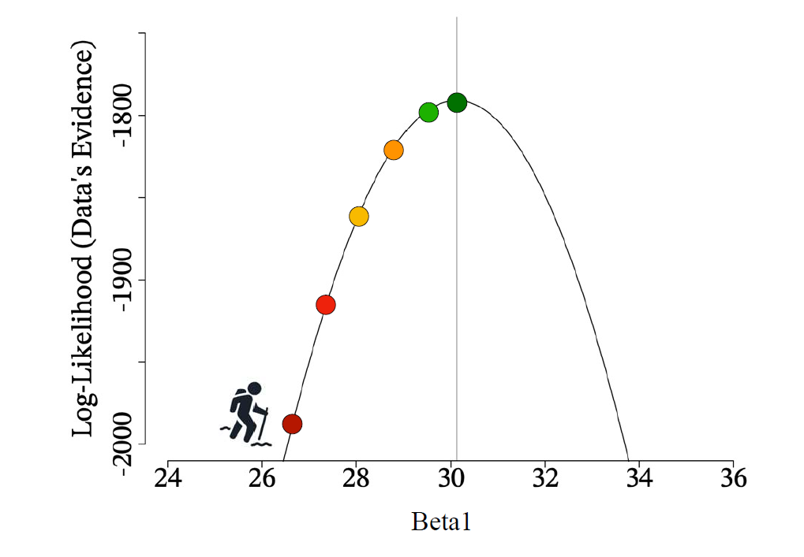
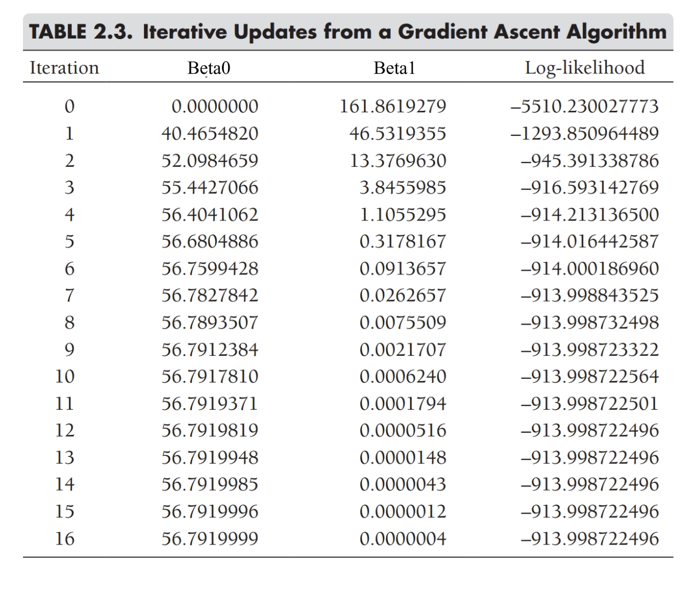

```{r}
#| echo: false


library(knitr)
library(formatR)
library(tidyverse)
opts_chunk$set(out.width = '100%', options(width=60))

opts_knit$set(global.par = TRUE)
opts_chunk$set(echo=FALSE, warning = FALSE, message = FALSE, comment = '', class.output='sh',
               fig.width=8, fig.height=5, fig.align = "center")

my_red <- "#E41A1C"
my_blue <- "#377EB8"
my_green <- "#4DAF4A"
my_purple <- "#984EA3"
my_orange <- "#FF7F00"
my_yellow <- "#FFFF33"
my_red2 <- "#FBB4AE" 
my_blue2 <- "#B3CDE3" 
my_green2 <- "#CCEBC5" 
my_purple2 <- "#DECBE4"
my_orange2 <- "#FED9A6"
my_yellow2 <- "#FFFFCC"

```

## Probability and Statistics

```{r}
#| fig.width: 6
#| fig.height: 2
#| out.width: "100%"

# Zero out standard plot margins
par(mar = c(0, 0, 0, 0))

# Initialize empty canvas
plot(0, 0, col = "white", xlim = c(0, 5), ylim = c(0, 3.5),
     bty = "n", xlab = "", ylab = "", xaxt = "n", yaxt = "n")

# --- Left Box (Population) ---
polygon(x = c(0.2, 1.7, 1.7, 0.2), y = c(2, 2, 3, 3), border = my_blue, lwd = 2)

# --- Right Box (Sample) ---
polygon(x = c(3.3, 4.8, 4.8, 3.3), y = c(.5, .5, 1.5, 1.5), border = my_purple, lwd = 2)

# --- Top Curve (Probability) ---
x_top <- seq(0.95, 4.05, length = 30)
y_top <- -0.478 * x_top^2 + 1.905 * x_top + 1.621
points(x_top, y_top, type = 'l', col = my_blue, lwd = 2)

# Top Arrow (pointing to Sample)
arrows(x0 = x_top[28], x1 = x_top[30], 
       y0 = y_top[28], y1 = y_top[30], 
       col = my_blue, lwd = 2)

# --- Bottom Curve (Statistics) ---
x_bot <- seq(0.95, 4.05, length = 30)
y_bot <- 0.435 * x_bot^2 - 2.656 * x_bot + 4.132
points(x_bot, y_bot, type = 'l', col = my_purple, lwd = 2)

# Bottom Arrow (pointing to Population)
arrows(x0 = x_bot[3], x1 = x_bot[1], 
       y0 = y_bot[3], y1 = y_bot[1], 
       col = my_purple, lwd = 2)

# --- Text Labels ---
text(x = 0.95, y = 2.65, "Population", col = my_blue)
text(x = 0.95, y = 2.35, "(Parameter)", col = my_blue)

text(x = 4.05, y = 1.15, "Sample", col = my_purple)
text(x = 4.05, y = 0.85, "(Data)", col = my_purple)

text(x = 3.1, y = 3.3, "Probability", col = my_blue)
text(x = 1.9, y = 0.3, "Statistics", col = my_purple)
```

:::: {style="font-size: 0.8em;"}
::: {style="margin-top: -10px;"}
Probability theory links data with parameters.

When we talk about probability distributions, we usually think of things as:

- Parameters: fixed quantities (knowns)
- Data: random variables (unknowns)

:::
::::


## The Bernoulli Distribution


The Bernoulli distribution can be written

$$P(y_i | \pi)=\pi^{y_i}(1-\pi)^{1-y_i}$$

Or, alternatively

$$P(y_i | \pi) = \pi(y_i) + (1 - \pi)(1 - y_i)$$

Where $y_i$ is always 0 or 1.

As a *probability* distribution, we will treat $\pi$ as known, and use it to define realizations of $y$


## Probability Mass Function

::: {style="font-size: 0.7em;"}
If I sample one gummy bear and $\pi_\text{pineapple} = .2$, then the distribution (PMF) of whether I draw a pineapple gummy bear in my sample is:
:::

```{r, fig.height = 4}
x <- 0:1
probability <- dbinom(x, size = 1, prob = .2)
ggplot(data.frame(x, probability), aes(x, probability)) +
  geom_col(fill = my_purple) + theme_light() +
  labs(x = "Number of Pineapple Gummy Bears", y = "Probability") +
  scale_x_continuous(breaks = c(0, 1)) + scale_y_continuous(limits = c(0,1),
                                                            n.breaks = 6) + 
  theme(axis.title = element_text(size = 14))
```

We like mass functions because each bar represents a discrete probability


## The Normal Distribution

The normal distribution is a continuous distribution with two parameters: $\mu$ and $\sigma$.

It can be written:

$$P(x_i | \mu, \sigma) = \frac{1}{\sigma\sqrt{2\pi}}e^{-\frac{1}{2}(\frac{x_i - \mu}{\sigma})^2}$$

The *standard* normal distribution is a special case of the normal distribution where $\mu = 0$ and $\sigma = 1$

We can plot a continuous probability distribution with a *density* plot (PDF)

## Normal Density Plot

```{r}

mu <- 0
sd_dat <- 1


x_seq <- seq(mu - 4 * sd_dat, mu + 4 * sd_dat, length.out = 1000)

# Calculate the density values
density_values <- dnorm(x_seq, mean = mu, sd = sd_dat)

data_df <- data.frame(x = x_seq, density = density_values)

# Plot the density using ggplot2
ggplot(data_df, aes(x = x, y = density)) +
  geom_line() +
  geom_area(fill = my_blue, alpha = .66) +
  xlab("x") + 
  ylab("Density") + theme_minimal()

```


## Densities and Probabilities

Densities are a bit confusing, because they aren't probabilities. They are the *height* of the distribution at any given point, scaled so that the entire area under the curve is equal to 1.

In terms of probabilities, we usually talk about them by "slicing up" the distribution.

For example, when we say that 68% of all observations lie within 1 SD of the mean, that means, literally, that 68% of the area under the curve is between -1 and 1

## Densities and Probabilities

```{r}

mu <- 0
sd_dat <- 1

# Generate a sequence of x values
x_seq <- seq(mu - 4*sd_dat, mu + 4*sd_dat, length.out = 1000)

# Calculate the density values
density_values <- dnorm(x_seq, mean = mu, sd = sd_dat)

data_df <- data.frame(x = x_seq, density = density_values)

dat_sub <- data_df %>% filter(x >= -1 & x <= 1)

# Plot the density using ggplot2
ggplot(data_df, aes(x = x, y = density)) +
  geom_line() +
  geom_area(fill = "purple", alpha = .5, data = dat_sub) +
  xlab("x") + 
  ylab("Density") + theme_minimal()
```


## What Does This Do for Us?

We're not (all) probability theorists. Most of us are applied statisticians.

So how does this help us?

**Specifically:** What is different about what we usually do in the real world from what we just described?

[We have *data* and want to estimate *parameters*]{.answer .fragment .content-visible unless-meta="params.v0"}

[Our situation is reversed! The data are known, parameters are not!]{.answer .fragment .content-visible unless-meta="params.v0"}


## Enter: Likelihood

A *likelihood* function switches things around, and assumes data are known and parameters are not.

BUT! 

A likelihood function is not a probability function! 

If we call $\boldsymbol{D}$ our data, and $\boldsymbol{\theta}$ our space of parameters ($\mu$ and $\sigma$ for a normal distribution), the function we are working with is still conceptually $P(\boldsymbol{D}|\boldsymbol{\theta})$

* This is a bit weird because we know $\boldsymbol{D}$ and are trying to estimate $\boldsymbol{\theta}$
* Which is NOT the same as $P(\boldsymbol{\theta} |\boldsymbol{D})$
    + We need Bayes' rule for this, more to come
* To avoid confusion usually write likelihood functions like this $\mathcal{L}(\boldsymbol{\theta};\boldsymbol{D})$
    + This is because with fixed $\boldsymbol{D}$ and unknown $\boldsymbol{\theta}$, the function $P(\boldsymbol{D}|\boldsymbol{\theta})$ won't sum to 1 under the curve
    + It would only do this for fixed $\boldsymbol{\theta}$ and unknown $\boldsymbol{D}$
    

## Turning the Tables


Let's imagine we flip a coin, but know nothing about coins. The coin lands on heads (we will treat Heads = 1, Tails = 0).

What is the *likelihood* for different values of $\pi$?

:::::{.fragment}

Let's figure it out by plugging in some different values to our Bernoulli function from before (Slide 4) Let's start with $\pi=0$

$\mathcal{L}(\pi = 0; y = 1) = \pi(1) + (1 - \pi)(1 - 1) = 0(1) + 1(0) = 0$

Unsurprisingly, the likelihood of the "true" probability of a coin landing on heads being zero, when it has landed on heads, is zero.

:::::


## Turning the Tables

What about $p = .25$?


[$\mathcal{L}( p = .25; y = 1) = p(1) + (1 - p)(1 - 1) = .25(1) + .75(0) = .25$]{.fragment}

[What about $p = .5$?]{.fragment}

[$\mathcal{L}( p = .5; y = 1) = p(1) + (1 - p)(1 - 1) = .5(1) + .5(0) = .5$]{.fragment}


[What about $p = .75$?]{.fragment}


[$\mathcal{L}( p = .75; y = 1) = p(1) + (1 - p)(1 - 1) = .75(1) + .25(0) = .75$]{.fragment}


[What about $p = 1$?]{.fragment}

[$\mathcal{L}(y = 1; p = 1) = p(1) + (1 - p)(1 - 1) = 1(1) + 0(0) = 1$]{.fragment}

## Likelihood Function of One Coin Flip Landing Heads

```{r}
#| message: false
#| warning: false

d <- data.frame(P_Heads = seq(-.5, 1.5, .1)) %>%
  mutate(Likelihood = ifelse(P_Heads < 0, 0, 
                             ifelse(P_Heads > 1, 0, 
                                    P_Heads)))

d <- rbind(d, data.frame(P_Heads = 1, Likelihood = 0)) %>%
  rename("p" = "P_Heads")

ggplot(d, aes(x = p, y = Likelihood)) + geom_line() + 
  geom_area(fill = my_blue, alpha = .66) +
  scale_x_continuous(breaks = seq(0, 1, .1), limits = c(0,1)) +
  theme_minimal()
```

## Maximum Likelihood

Note that unlike a probability function, the $x$-axis of a likelihood function is the parameter (in this example $p$), not the random variable (the outcome of the coin flips).

The goal of *maximum* likelihood, is to find the parameter value that maximizes the likelihood function.

In this case, the "likeliest" probability value to produce exactly one coin flip landing heads is 1.

We can also tell from this exercise that likelihoods are not probabilities. How?

[The area of the graph of the likelihood function is not 1]{.answer .fragment .content-visible unless-meta="params.v0"}

[Likelihood does not have a clear interpretation the way probability does. It is a measure of the strength of evidence for various parameter values, but it doesn't really have a precise meaning]{.fragment}

## A Slightly More Complex Example

What is the maximum likelihood value for one flip landing heads, then one flip landing tails?

How might we approach this problem?

[To get the joint probability of two independent events, you take the product of each of their probabilities. So we solve for flip 1 for a given $p$, then flip 2 for that $p$, and multiply them]{.answer .fragment .content-visible unless-meta="params.v0"}

## Two Coins

[$p = 0$?]{.fragment}

[$\mathcal{L}(p = 0; y_1 = 1, y_2 = 0) = \mathcal{L}(p = 0; y_1 = 1) \times \mathcal{L}(p = 0; y_2 = 0) = (0)(1) = 0$]{.fragment}

[$p = .25$?]{.fragment}

[$\mathcal{L}(p = .25; y_1 = 1, y_2 = 0) = \mathcal{L}(p = .25; y_1 = 1) \times \mathcal{L}(p = .25; y_2 = 0) = (.25)(.75) = .1875$]{.fragment}

[$p = .5$?]{.fragment}

[$\mathcal{L}(p = .5; y_1 = 1, y_2 = 0) = \mathcal{L}(p = .5; y_1 = 1) \times \mathcal{L}(p = .5; y_2 = 0) = (.5)(.5) = .25$]{.fragment}

[$p = .75$?]{.fragment}

[$\mathcal{L}(p = .75; y_1 = 1, y_2 = 0) = \mathcal{L}(p = .75; y_1 = 1) \times \mathcal{L}(p = .75; y_2 = 0) = (.75)(.25) = .1875$]{.fragment}

## Two Coins

```{r}

d2 <- d %>% 
  mutate(Likelihood = Likelihood * (1 - Likelihood))

ggplot(d2, aes(x = p, y = Likelihood)) + geom_line() +  
  geom_area(fill = my_blue, alpha = .66) +
  scale_x_continuous(breaks = seq(0, 1, .1), limits = c(0,1)) +
  xlab("p") +
  theme_minimal()
```

## Maximum Likelihood

To find the maximally likely value, we simply find the highest point on this graph.

In this case, the most likely value of $p$ to produce one heads and one tails in two coin flips is $p = .5$

## Log Likelihood

Once we start getting a lot of data, we wind up multiplying a lot of probability values together.

If we have a dataset with $N$ rows, our likelihood function becomes:

$$L(\boldsymbol{\theta}; \boldsymbol{D}) = \prod_{i=1}^N \mathcal{L}(\boldsymbol{\theta}; d_i)$$

What happens when we multiply a lot of probability values (always between 0 and 1)?

[The product becomes increasingly small, so small computers can't handle it!]{.answer .fragment .content-visible unless-meta="params.v0"}

[So what if we take the log? How does that change things?]{.answer .fragment .content-visible unless-meta="params.v0"}

## Log Likelihood

**Product Rule:** $\log(A \times B) = \log(A) + \log(B)$

Applying the product rule:

$$LL(\boldsymbol{\theta}; \boldsymbol{D}) = \log\big(\prod_{i=1}^N \mathcal{L}(\boldsymbol{\theta}; d_i)\big) = \sum_{i=1}^N \log\big(\mathcal{L}(\boldsymbol{\theta}; d_i )\big)$$

Now instead of multiplying lots of decimals, we wind up adding lots of (negative) numbers!

::: {.small}
* (The log of any number $x$ where $0 < x < 1$ will be negative)
:::

This both helps with computation and means we don't have extremely small numbers to deal with multiplying:

* Addition is faster than multiplication
* Small numbers are annoying/hard to represent
* Computers can't go to infinite decimal places

Rank order is preserved under log transformation, so this doesn't change our search for the maximum point.

## Finding the Maximum: Grid Search

The most brute force approach to finding the maximum is **grid search**.

This just involves plugging in as many possible parameter values as possible to the likelihood function, and choosing the largest value. Because the rank order is preserved, it doesn't matter if we use likelihood or log likelihood.

```{r}


p1 <- ggplot(d2, aes(x = p, y = Likelihood)) + geom_line() + geom_point() + 
  geom_area(fill = my_blue, alpha = .66) +
  scale_x_continuous(breaks = seq(0, 1, .1), limits = c(0,1)) +
  xlab("p") + theme_minimal()

p2 <- ggplot(d2, aes(x = p, y = log(Likelihood))) +
  geom_line(color = "black") +
  geom_point() +
  geom_ribbon(aes(ymin = min(log(Likelihood)), ymax = log(Likelihood)),
              fill = my_blue, alpha = 0.66) +
  scale_x_continuous(breaks = seq(0, 1, .1), limits = c(0,1)) +
  xlab("p") +
  theme_minimal()

gridExtra::grid.arrange(p1, p2, nrow = 1)
```

## Normal Distribution Likleihood

The same logic applies to any distribution:

$$LL(\boldsymbol{x}| \mu, \sigma) = \sum_{i=1}^N \log\bigg(\frac{1}{\sigma\sqrt{2\pi}}e^{-\frac{1}{2}(\frac{x_i - \mu}{\sigma})^2}\bigg)$$

We can plug in for different combinations of:

* $\mu$ 
* $\sigma$ 

Then take our variable, $\boldsymbol{x}$, and sum up the log likelihoods for all of the observed values in our variable.

The combination of $\mu$ and $\sigma$ with the largest log likelihood are the **maximum likelihood** estimates of those parameters.

## Linear Model Likelihood

In a general linear model, we assume the residuals are normally distributed with a mean of 0. Put another way, each observation for the outcome variable $y_i$ follows a normal distribution with mean $\hat{y_i}$ and residual variance $\sigma_{\epsilon}$

$$LL(\boldsymbol{y}| \boldsymbol{\beta}, \sigma) = \sum_{i=1}^N \log\bigg(\frac{1}{\sigma_{\epsilon}\sqrt{2\pi}}e^{-\frac{1}{2}(\frac{y_i - \hat{y}_i}{\sigma_{\epsilon}})^2}\bigg)$$

Where

$$\hat{y}_i = \beta_0 + \sum_{p=1}^P \beta_p x_{ip}$$

And We plug in for different combinations of:

* $\beta_0 \dots \beta_P$ 
* $\sigma$ 


## Grid Search Alternatives

When you have a continuous distribution, like a normal distribution, grid search is often intractable. 

There is too much data and too many possible parameter values to search across. Finding the peak would be very slow going.

A popular alternative is based on "hill climbing" algorithms

* These are more formally referred to as gradient ascent or gradient descent 

    + Gradient ascent: Trying to find the peak of the distribution
    
    + Gradient descent: Trying to find the bottom of the distribution


## Gradient Ascent/Descent

Procedure:

* Step 1: Try a random parameter value (or combo of parameter values)
* Step 2: Check the log likelihood
* Step 3: Try another value that's slightly larger than the starting value
* Step 4: Check the log likelihood
* Step 5:
    + If the log likelihood in Step 4 increased, try a value larger than the value(s) in Step 3
    + If the log likelihood in Step 4 decreased, try a value smaller than the value in Step 1 for at least one parameter
* Repeat process until change in the log likelihood is (approximately) 0 between steps

## Hill Climbing



Gradient ascent is like trying to find the peak of the hill

## Iteration Table



As we try different values, we check if the log likelihood increases or decreases, and stop once the change between iterations gets close to zero

## So What?

Maximum likelihood is a very flexible method for **estimating** general linear models. 

- There are frequentist inference methods that use maximum likelihood, but they're beyond the scope of our class
  - You will learn more about these in classes like multilevel models or structural equation modeling
  - Getting an early intuition for likelihood also helps as a foundation for many different machine learning techniques


We needed this detour because likelihood functions **also** play a large role in Bayesian inference!


